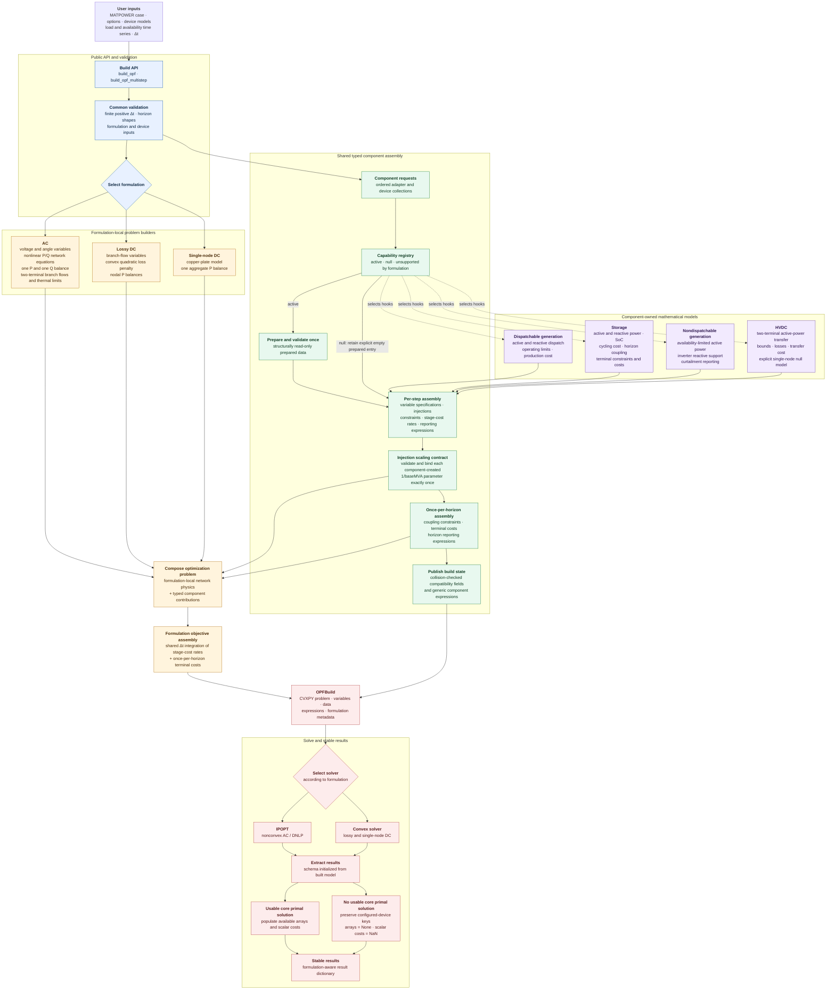
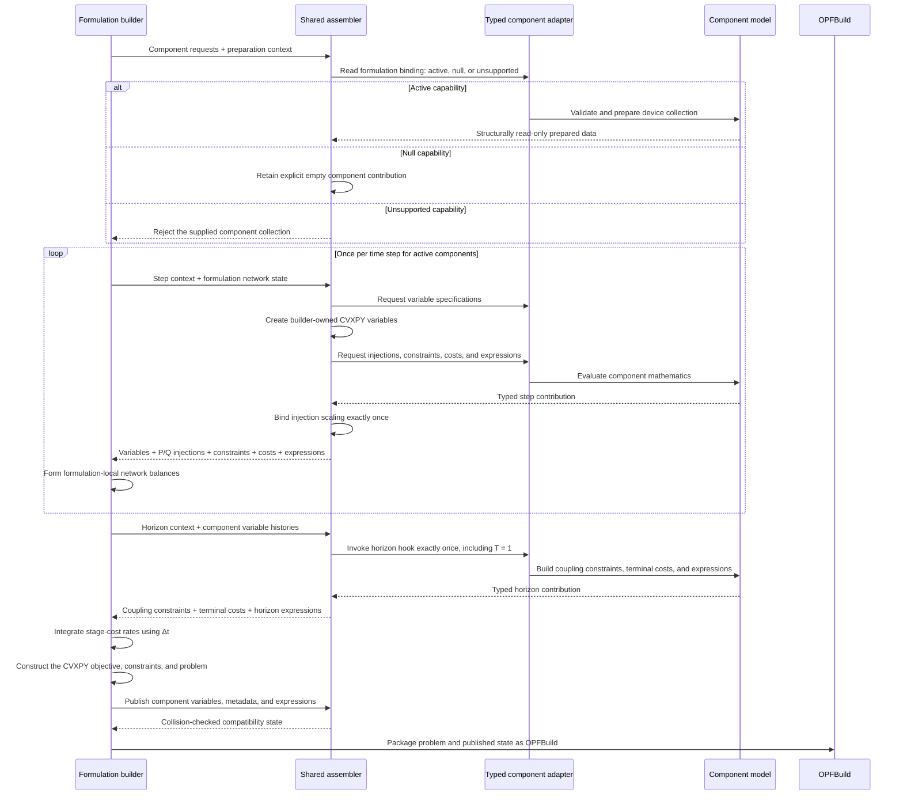

# cvxopf software architecture

This diagram records the software structure implemented by API hardening and
Milestone 16+. It describes the current problem-construction and result paths
before the Milestone 17 hierarchical DC/AC controller is added.

## Component contribution lifecycle

The shared assembler coordinates the lifecycle, while component modules retain
their device mathematics and formulation builders retain network physics.

## Architectural invariants

- Components contribute signed network injections; formulations own network
  equations and the unique power balances.
- Component adapters expose declarative variable specifications derived from
  component-owned models; shared assembly instantiates the `cvxpy.Variable`
  objects.
- Prepared component mappings are defensively copied and read-only; contained
  NumPy arrays and CVXPY objects are not deeply frozen.
- Device models construct per-unit injection expressions using unbound
  inverse-base `cvxpy.Parameter` objects; shared assembly validates and binds
  each parameter exactly once.
- Every configured component has an explicit formulation capability. A null
  capability is intentional model elimination, not accidental omission.
- HVDC is active in AC and lossy DC and explicitly null in single-node DC,
  where both terminals and the intervening network have been collapsed.
- Stage-cost rates are integrated using the time-step duration. Terminal costs
  are applied once per horizon and remain outside that time integral.
- Per-step reporting expressions become ordered histories in multistep builds;
  horizon expressions are published once and are not time-scaled.
- `OPFBuild` is the boundary between model construction and solving; result
  extraction does not reconstruct the model.
- Result schemas are determined from the built model, so unsuccessful solves
  retain configured-device keys with explicit unavailable values.
- A repository-supported component is registered once for generic mathematical
  assembly across formulations. Exposing a new component through the public API
  still requires ordinary input and parser plumbing; this is a closed-world
  internal architecture, not a dynamic plugin interface.

## Scope boundary

Milestone 17 will sit above this architecture as a controller that coordinates
long-horizon convex planning and short-horizon AC feasibility/correction
solves. It will consume the same public build, solve, and result interfaces;
it should not bypass the typed component assembly or move network physics into
the orchestration layer.
