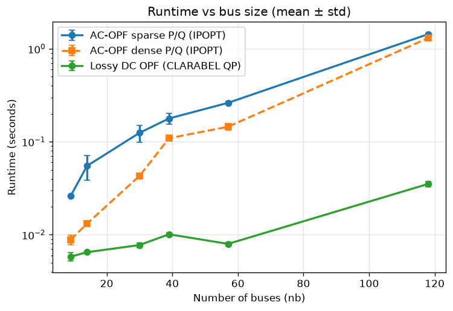

# cvxopf

[](https://github.com/cvxgrp/cvxopf/actions/workflows/ci.yml)
[](https://codecov.io/gh/cvxgrp/cvxopf)

Optimal power flow via CVXPY, supporting AC-OPF (nonconvex, DNLP),
lossy DC OPF (convex QP), and single-node DC dispatch (convex QP).

## Motivation

Grid resiliency events rarely happen in an instant. The most dangerous
scenarios unfold over days: solar suppressed by sustained weather systems,
load elevated beyond seasonal norms, and battery storage depleted by
controllers that optimize for the current hour. Studying the 
behavior of the modern grid under these conditions and developing optimal
control policies requires an optimization framework that is simultaneously
time-aware and physically grounded, that is able to plan dispatch strategy 
across a full multi-day horizon and able to enforce the AC network
constraints that determine whether a plan is actually executable. 

`cvxopf` is designed with this application in mind. It formulates optimal power
flow problems using CVXPY, supports full AC-OPF, a convex lossy DC relaxation,
and single-node economic dispatch from a single entry point (with more to
come), and handles multi-step
optimization with time-varying load, battery storage, and nondispatchable generation
(wind, solar, hydro) natively. The intended use case is resiliency research:
studying how battery controllers should behave under adverse multi-day
conditions, how much temporal foresight matters, and how well convex
approximations track AC feasibility across extended horizons.

Because it is built on CVXPY, the problem structure is transparent and
composable. Researchers can modify objectives, add contingency constraints,
or experiment with formulations — including multi-forecast Model Predictive
Control — without rewriting solver interfaces.

## Overview

`cvxopf` formulates optimal power flow problems using CVXPY and solves them
with appropriate solvers. It is designed to:

- Run MATPOWER/Pypower test cases out of the box
- Support multiple OPF formulations from a single entry point
- Support single-shot optimization over multiple time steps
- Accept time-varying nodal load as pandas DataFrames
- Model energy storage with state-of-charge dynamics
- Model nondispatchable generators (wind, solar, run-of-river hydro) with
  curtailable output and reactive power support

### Formulations

| Key | Description | Convex | Solver |
|---|---|---|---|
| `"ac"` | Full AC-OPF via CVXPY DNLP (requires `cvxpy>=1.9`) | No | IPOPT |
| `"lossy_dc"` | Lossy DC OPF (Boyd et al.) | Yes | CLARABEL |
| `"singlenode_dc"` | Single-node "copper-plate" DC dispatch | Yes | CLARABEL |

The `"singlenode_dc"` formulation collapses the whole network to a single
bus: no branch flows, no transmission limits, no losses, no reactive power —
just total generation equals total load. It is the classic economic dispatch
problem, useful as a fast baseline and for large-horizon energy planning.

The intended workflow for large-scale resiliency studies is hierarchical:
solve the convex `lossy_dc` formulation over the full planning horizon to
obtain a globally optimal battery SoC trajectory and dispatch plan, then use
the AC formulation over a short receding horizon to verify and correct for
true network physics, with SoC targets inherited from the convex layer as
boundary constraints.

References:

- AC OPF: *Disciplined Nonlinear Programming*,
  https://stanford.edu/~boyd/papers/dnlp.html,
  https://github.com/cvxgrp/dnlp-examples/blob/main/nlp_examples/power_flow.ipynb
- Lossy DC OPF: *Convex Optimization with Smart Grid Examples*,
  https://doi.org/10.2172/3018252

## Prerequisites

`cvxopf` requires the IPOPT nonlinear solver system library. This must be
installed before running `pip install cvxopf`.

**Ubuntu / Debian**
```bash
sudo apt-get update
sudo apt-get install -y coinor-libipopt-dev liblapack-dev libblas-dev gfortran
```

> **Note:** On Linux, `coinor-libipopt-dev` alone is not sufficient.
> `liblapack-dev`, `libblas-dev`, and `gfortran` are also required because
> IPOPT's internal linear solver (MUMPS) links against them at build time.
> Without these, `pip install cvxopf` will fail when building `cyipopt`
> with a linker error (`cannot find -llapack`, `cannot find -lblas`).

**macOS**
```bash
brew install ipopt
```

**Windows** (conda recommended)
```bash
conda install -c conda-forge ipopt
```

Full IPOPT installation documentation:
https://coin-or.github.io/Ipopt/INSTALL.html

## Installation

Once the IPOPT system library is installed:

```bash
pip install git+https://github.com/cvxgrp/cvxopf.git
```

This will automatically install all Python dependencies including `cyipopt`
(the Python interface to IPOPT), `cvxpy`, `numpy`, and `pandas`.

When the package is published to PyPI, installation will simplify to:

```bash
pip install cvxopf  # coming soon
```

## Quick start

**AC-OPF:**

```python
from cvxopf.testcases import case9
from cvxopf.problem import build_opf
from cvxopf.results import extract_results

build = build_opf(case9(), formulation="ac")
build.solve()
results = extract_results(build)
print(f"Objective: {results['objective']:.2f} $/hr")
print(f"Pg (MW):   {results['Pg']}")
```

**Lossy DC OPF:**

```python
from cvxopf.testcases import case14
from cvxopf.problem import build_opf
from cvxopf.results import extract_results

build = build_opf(case14(), formulation="lossy_dc")
build.solve()
results = extract_results(build)
print(f"Objective:  {results['objective']:.2f} $/hr")
print(f"Pg (MW):    {results['Pg']}")
print(f"Flows (MW): {results['p_flows']}")
```

**Single-node DC dispatch:**

Any MATPOWER case works (the branch table is ignored), or use the
`make_singlenode_case` convenience constructor to build a minimal
economic-dispatch problem without a full network:

```python
from cvxopf.testcases import make_singlenode_case
from cvxopf.problem import build_opf
from cvxopf.generator import DispatchableGenerator
from cvxopf.results import extract_results

case = make_singlenode_case(
    P_load_MW=250.0,
    generators=[
        DispatchableGenerator(
            bus=1, p_max_mw=200.0, cost_coeffs=(0.0, 10.0, 0.05)
        ),
        DispatchableGenerator(
            bus=1, p_max_mw=150.0, cost_coeffs=(0.0, 15.0, 0.08)
        ),
    ],
)

build = build_opf(case, formulation="singlenode_dc")
build.solve()
results = extract_results(build)
print(f"Objective: {results['objective']:.2f} $/hr")
print(f"Pg (MW):   {results['Pg']}")
```

The `examples/case14_formulation_comparison.py` script solves the IEEE
14-bus case with all three formulations side by side and contrasts their
dispatch and implied losses.

### First-class dispatchable generators

Pass `DispatchableGenerator` objects to define generator locations, operating
bounds, and costs directly. Polynomial costs use lowest-power-first
coefficients and are limited to degree two; piecewise-linear costs use
explicit `(power_MW, cost)`
breakpoints. All cost expressions are evaluated by the shared implementation
in `cost.py`.

```python
from cvxopf import DispatchableGenerator, build_opf

generators = [
    DispatchableGenerator(
        bus=1,
        p_min_mw=10.0,
        p_max_mw=250.0,
        q_min_mvar=-300.0,
        q_max_mvar=300.0,
        cost_type="piecewise_linear",
        cost_points=((0.0, 0.0), (100.0, 2500.0), (250.0, 7250.0)),
    ),
]

# network_case needs bus, branch, and baseMVA, but may omit gen/gencost.
build = build_opf(network_case, formulation="ac", generators=generators)
```

For backward compatibility, omitting `generators=` converts the case's
MATPOWER `gen` and `gencost` tables to the same component representation at
build time. Supplying `generators=` overrides those tables; they may be absent,
and the input case dict is not mutated.

## Interactive notebooks

We recommend using `uv` (https://docs.astral.sh/uv/) to run the notebooks.
From the project root:

```bash
uv run --extra notebook marimo run notebooks/cvxopf_demo.py
```

Select a test case (case9 through case118), choose AC-OPF or lossy DC OPF,
adjust generator limits, branch flow limits, and load scale interactively.
Results update automatically after each solve.

```bash
uv run --extra notebook marimo run notebooks/benchmark_opf.py
```

Select number of repetitions and run a timing study across all test cases
and OPF configurations. The results should look something like this:



## Multi-step example

Time-varying load is passed as a DataFrame — one row per timestep, one
column per bus. This is the foundation for resiliency studies: feed in
a multi-day solar and load profile and the optimizer plans dispatch
across the full horizon in a single solve.

```python
import numpy as np
import pandas as pd
from cvxopf.testcases import case9
from cvxopf.problem import build_opf_multistep
from cvxopf.results import extract_results

ppc     = case9()
T       = 3
Pd_base = ppc["bus"][:, 2]
Qd_base = ppc["bus"][:, 3]

# Three time steps at 80%, 100%, 120% of base load
scales  = [0.8, 1.0, 1.2]
df_P    = pd.DataFrame(np.outer(scales, Pd_base))
df_Q    = pd.DataFrame(np.outer(scales, Qd_base))

build   = build_opf_multistep(ppc, df_P, df_Q, T=T, formulation="ac")
build.solve()
results = extract_results(build)
print(f"Total objective: {results['objective']:.2f} $/hr")
print(f"Pg per step (MW):\n{results['Pg']}")
```

## Battery storage example

Battery state-of-charge evolves across timesteps, coupling decisions made
at hour 1 to feasibility at hour 72. This intertemporal coupling is why
multi-step optimization matters for resiliency: the optimizer can see that
conditions worsen on day 3 and hold reserves accordingly rather than
depleting storage on day 1.

```python
import numpy as np
import pandas as pd
from cvxopf.testcases import case9
from cvxopf.problem import build_opf_multistep, StorageUnitIdeal
from cvxopf.results import extract_results

ppc     = case9()
T       = 3
Pd_base = ppc["bus"][:, 2]
Qd_base = ppc["bus"][:, 3]

scales = [0.8, 1.0, 1.2]
df_P   = pd.DataFrame(np.outer(scales, Pd_base))
df_Q   = pd.DataFrame(np.outer(scales, Qd_base))

unit = StorageUnitIdeal(
    bus=5,
    apparent_power_rating=50.0,  # MVA
    capacity=100.0,              # MWh
    initial_soc=50.0,            # MWh
    aging_weight=1e-2,           # $/MW
)

build = build_opf_multistep(
    ppc, df_P, df_Q, T=T, formulation="ac",
    storage=[unit], delta=1.0,
)
build.solve()
results = extract_results(build)
print(f"Total objective: {results['objective']:.2f} $/hr")
print(f"Storage real power (MW): {results['b']}")
print(f"State of charge (MWh):   {results['soc']}")
```

## Nondispatchable generator example

Nondispatchable generators (wind turbines, PV arrays, run-of-river hydro)
produce up to a time-varying available power `R_t` determined by ambient
conditions. The OPF can curtail freely; there is no cost for generation or
curtailment. In AC, the inverter also provides reactive power support within
its apparent power rating. Passing a multi-day solar availability profile
via `df_nd` lets the optimizer account for sustained generation shortfalls
across the full planning horizon.

```python
import numpy as np
import pandas as pd
from cvxopf.testcases import case9
from cvxopf.problem import build_opf_multistep, NondispatchableUnit
from cvxopf.results import extract_results

ppc     = case9()
T       = 3
Pd_base = ppc["bus"][:, 2]
Qd_base = ppc["bus"][:, 3]

scales = [0.8, 1.0, 1.2]
df_P   = pd.DataFrame(np.outer(scales, Pd_base))
df_Q   = pd.DataFrame(np.outer(scales, Qd_base))

# Solar unit on bus 5: available output ramps down over three steps,
# simulating a multi-day irradiance suppression event
unit  = NondispatchableUnit(
    bus=5,
    p_available=100.0,            # MW — fallback for single-step
    apparent_power_rating=120.0,  # MVA — inverter nameplate
    device_id="solar_5",          # stable key for external time series
)
df_nd = pd.DataFrame({"solar_5": [100.0, 75.0, 50.0]})

build = build_opf_multistep(
    ppc, df_P, df_Q, T=T, formulation="ac",
    nondispatchable=[unit], df_nd=df_nd,
)
build.solve()
results = extract_results(build)
print(f"Total objective:      {results['objective']:.2f} $/hr")
print(f"ND real power (MW):   {results['p_nd']}")
print(f"ND reactive (MVAr):   {results['q_nd']}")
print(f"Curtailment (MW):     {results['curtailment']}")
```

## HVDC transmission link example

HVDC links are controllable point-to-point power transfers between two buses,
modelled as signed nodal injections (Convention B: positive = injection into
the grid) subject to capacity limits. On fixed-direction links the converter
loss is proportional (`p_out = -(1 - loss_frac) * p_in`). Links can be built
directly as `HVDCLink` objects or imported from a MATPOWER `dcline` table via
`hvdc_from_dcline`. The MVP is unity power factor and drops fixed converter
loss (`loss0`, emitting a `UserWarning`); it applies to both the AC and lossy
DC formulations.

```python
from cvxopf.testcases.case9_dcline import case9_dcline
from cvxopf.problem import build_opf
from cvxopf.hvdc import hvdc_from_dcline
from cvxopf.results import extract_results

ppc   = case9_dcline()
links = hvdc_from_dcline(ppc["dcline"])  # three in-service DC links

build = build_opf(ppc, formulation="ac", hvdc=links)
build.solve()
results = extract_results(build)
print(f"Objective:          {results['objective']:.2f} $/hr")
print(f"HVDC in  (MW):      {results['p_hvdc_in']}")
print(f"HVDC out (MW):      {results['p_hvdc_out']}")
print(f"HVDC loss (MW):     {results['hvdc_loss']}")
```

## Project structure

```
src/cvxopf/           Core package
  problem.py          Public API: build_opf, build_opf_multistep
  ac_problem.py       AC-OPF helpers (DNLP formulation)
  dc_problem.py       Lossy DC OPF helpers (convex QP)
  singlenode_dc_problem.py  Single-node DC dispatch helpers (convex QP)
  network.py          Ybus, incidence matrices, reindexing
  cost.py             Generator cost expression builders
  generator.py        DispatchableGenerator component and MATPOWER conversion
  data.py             Input validation and time-series handling
  results.py          Result extraction and comparison utilities
  storage.py          Storage component: data, injections, constraints, cost
  nondispatchable.py  ND component: data, injections, and constraints
  hvdc.py             HVDC component and MATPOWER dcline conversion
  testcases/          Built-in MATPOWER test cases (case9 — case118)
tests/                Pytest test suite
tests/fixtures/       Committed Pypower reference outputs (static)
scripts/              Fixture and test case generation scripts
notebooks/            Interactive marimo notebooks
examples/             Runnable example scripts
```

## Development

Clone the repository and install in editable mode with development
dependencies:

```bash
git clone https://github.com/cvxgrp/cvxopf.git
cd cvxopf
```

If you have `uv` installed, that's it. Just run things with `uv` from the
project root.

If you are managing your own virtual environment, install the development
dependencies with pip:

```bash
pip install -e ".[dev]"
```

If you want to run the Marimo notebooks, you'll want the notebook
dependencies as well:

```bash
pip install -e ".[dev,notebook]"
```

To run the test suite:

```bash
# If using uv (recommended)
uv run --extra dev pytest tests/ -v

# If installed directly with pip
pytest tests/ -v
```

To regenerate the Pypower reference fixtures (requires `uv`):

```bash
uv run scripts/generate_pypower_fixtures.py
```

Note: the fixture script runs in an isolated environment with pinned
`pypower==5.1.19` and `numpy==2.2.6`. It does not affect the main
package environment.

## Roadmap

- [x] Repository skeleton
- [x] Port and modularize working code
- [x] Pypower fixture generation and validation tests
- [x] Multi-step problem builder
- [ ] Branch flow limits (AC)
- [x] Battery/storage model
- [x] Lossy DC OPF and multi-formulation architecture
- [x] HVDC transmission links (lossless + fixed-direction proportional loss)
- [ ] Full lossy HVDC (sign-switching converter losses via charge/discharge split)
- [x] Nondispatchable generators
- [x] Sparse P/Q variables for AC-OPF
- [x] Single-node equivalent "copper plate" model
- [ ] SOCP network model
- [ ] Extend battery parameters: final SoC, penalty vs constraint
- [ ] Implement cvxpy parameters for problem data
- [ ] Vectorize time constraints (currently built with iterative loop)
- [ ] Full lossy HVDC (sign-switching converter losses) with reactive power support
- [ ] **In progress:** unify grid component model patterns (generator component
  module landed; constructor integration, storage, and nondispatchable remain)
- [ ] Hierarchical DC→AC receding-horizon dispatch (long-horizon convex plan passes SoC signposts into a short AC window; the implementation of the core vision)
