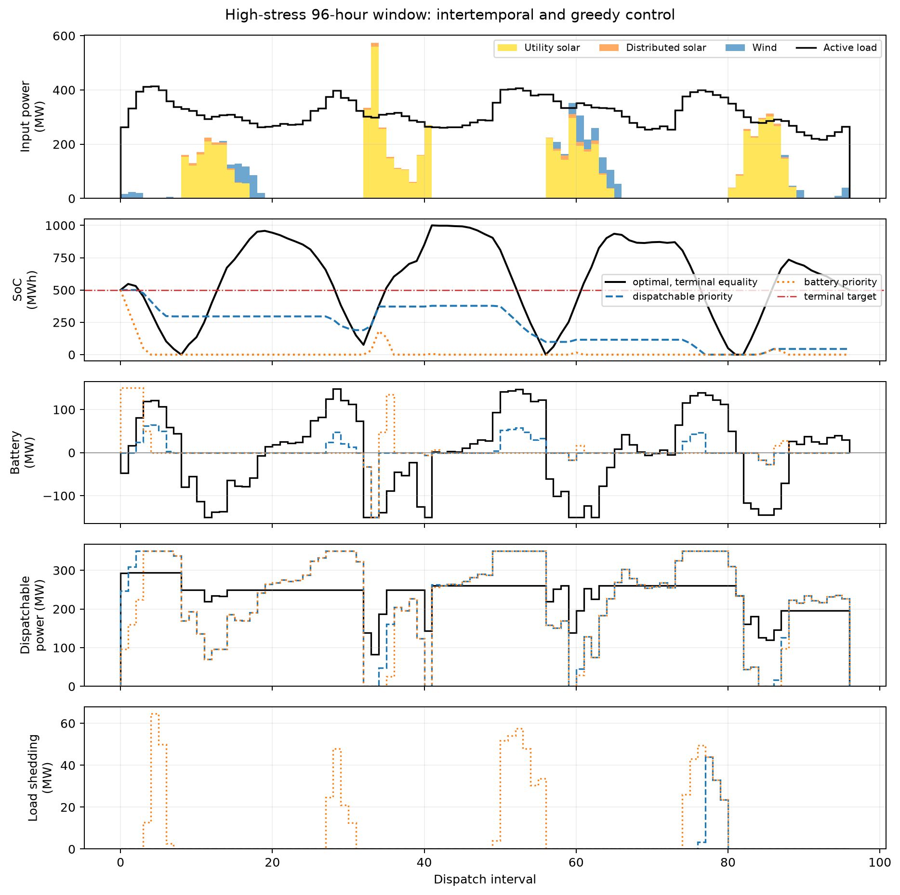
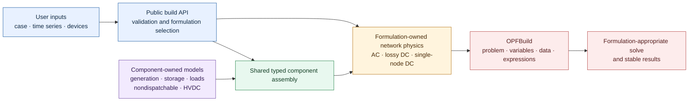
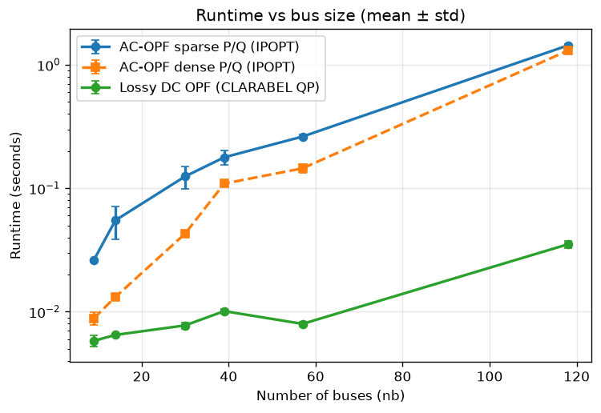

# cvxopf

[](https://github.com/cvxgrp/cvxopf/actions/workflows/ci.yml)
[](https://codecov.io/gh/cvxgrp/cvxopf)

Optimal power flow via CVXPY, supporting AC-OPF (nonconvex, DNLP),
lossy DC OPF (convex QP), and single-node DC dispatch (convex QP).

## Motivation

Grid resilience events rarely happen in an instant. The most consequential
scenarios can unfold over days, months, or longer: weather suppresses renewable
generation, demand remains elevated, geographically concentrated resources are
damaged, recovery is gradual, and short-sighted controllers deplete storage
before the system reaches its most constrained period. Studying these events
requires an optimization framework that is both time-aware and physically
grounded: it must coordinate decisions across long horizons while retaining
the AC network constraints that determine whether a plan is realizable.

`cvxopf` is designed for that research problem. From one modeling framework it
supports nonlinear AC-OPF, convex lossy DC OPF, and single-node economic
dispatch, together with multistep load, generation, storage, and transmission
models. It is not intended merely as another OPF wrapper. It is the foundation
for a scientifically coherent method for studying long-duration, uncertain,
and compound resilience events without giving up access to nonlinear network
physics.

Long horizons preserve modeled storage, resource, damage, and recovery states
across sequential events. Convex formulations make planning and broad scenario
screening tractable. Selected nonlinear AC-OPF intervals can then redispatch
active power, reactive support, and voltage state within the AC feasible set,
rather than merely checking a fixed coarse-model dispatch.

The larger research program is organized around the chain

```text
rare-event uncertainty
        -> long-horizon adaptive planning
        -> convex ensemble screening
        -> nonlinear AC realization
        -> audited resilience conclusions
```

The implemented package already provides the multi-fidelity component models,
intertemporal storage, hierarchical DC-to-AC state handoff, nonlinear-solver
recovery, and independent residual audits that support this direction.
General stochastic investment planning and GPU-batched uncertainty ensembles
remain research extensions rather than current package claims.

Storage is treated as an intertemporal network device, not as a sequence of
independent power injections. A multi-step solve co-optimizes the complete
dispatch and state-of-charge trajectories, including power and energy limits
and configurable terminal constraints or costs. This temporal coupling changes
both the feasible set and the economics of the OPF: stored energy acquires an
opportunity value, strongly convex generation costs induce levelization, and
the controller can preserve energy for future scarcity.



*High-stress 96-hour comparison with a 500 MWh terminal target. The
experiment augments the 9-bus test case with nondispatchable generation and a
single storage device, driven by time-series load and renewable-availability
inputs supplied through the native `df_P`, `df_Q`, and `df_nd` pandas
interfaces. The top panel shows the active load together with the utility
solar, distributed solar, and wind availability supplied to the model. The
network-constrained optimum anticipates future scarcity and enforces the
terminal state; the causal greedy controllers are terminal-blind. Their lower
dispatchable-energy totals are not improvements where they accompany unserved
load.*

Because it is built on CVXPY, the mathematical structure is transparent and
composable. Researchers can add device models, objectives, and operating
constraints or study alternative network formulations without rewriting
solver interfaces.

## Overview

`cvxopf` formulates optimal power flow problems using CVXPY and solves them
with appropriate solvers. It is designed to:

- Run MATPOWER/Pypower test cases out of the box.
- Support multiple OPF formulations from a single entry point.
- Support single-shot optimization over multiple time steps.
- Accept time-varying nodal load as pandas DataFrames.
- Model storage as a first-class intertemporal device with state-of-charge
  coupling and configurable terminal policies.
- Model nondispatchable generators (wind, solar, run-of-river hydro) with
  curtailable output and reactive power support.
- Model loads as first-class, identity-aligned devices with optional
  single-solve shedding and energy-not-served reporting.
- Coordinate long-horizon convex battery planning with audited short-horizon
  AC execution through the public hierarchical controller.

### Methodology

Many individual capabilities exposed by `cvxopf`, including multi-period OPF
and intertemporal storage, also appear in other power-system optimization
packages. The central contribution here is their organization within a
[disciplined convex programming (DCP)](https://www.cvxpy.org/tutorial/dcp/)
and [disciplined nonlinear programming
(DNLP)](https://www.cvxpy.org/tutorial/dnlp/index.html) methodology. Device
dynamics, costs, and operating sets remain convex wherever the model permits,
while the nonconvexity of the full AC formulation is confined to the
network-flow physics.

This separation supports the implemented hierarchical solve structure. A
globally solvable, long-horizon convex layer determines intertemporal energy
decisions and passes device states, especially battery state of charge, to a
short-horizon AC layer. The AC layer verifies and corrects for modeled
nonlinear network physics without needing to reproduce the approximate
dispatch trajectory.

Nondispatchable resources are likewise first-class devices rather than generic
generator boxes: time-varying real-power availability is coupled to a convex
inverter apparent-power region in AC and to separate availability and rating
bounds in DC. This preserves the converter-capacity limit without adding
nonconvexity.

Loads follow the same component boundary. MATPOWER bus demand is converted
automatically, while explicit `Load` objects provide stable identity for
time-series alignment and optional interruption policies. Shedding is an
affine extension of the load feasible set with a high linear value-of-lost-load
cost in the original optimization problem; it is not a lexicographic pass, an
anonymous balance slack, or a second feasibility-restoration solve.

#### Economic decisions from modeled primitives

CVXOPF constructs economic dispatch from explicit physical and economic
primitives:

- generator cost curves;
- load and renewable availability;
- network limits and either physical AC losses or a documented DC loss proxy;
- storage dynamics, cycling cost, and terminal policy (with ideal efficiency
  in the current `StorageUnitIdeal` model);
- load-shedding cost; and
- the evolving intertemporal system state.

Exogenous electricity-price trajectories are not first-class inputs to the
current model. Dispatch costs and scarcity consequences are represented
directly, while marginal values arise endogenously from the optimization. This
distinction is especially important in black-sky studies: a historical price
series reflects a different network state, asset fleet, market design, and
damage condition. Using that scalar signal to stand in for widespread outages,
physical scarcity, customer consequences, and months of recovery would ask it
to reconstruct interactions that the model had omitted.

This does not imply that tariffs, contracts, or other explicit economic rules
can never be modeled. When they are part of the scientific question, they
should enter transparently as defined costs or constraints rather than serve
as substitutes for available physical structure.

AC voltage magnitudes and reactive dispatch are currently governed by their
physical bounds and network equations but are generally not assigned an
operating preference in the objective. Reactive variables can therefore reach
a limit because support is physically required, because the economic optimum
is nonunique in reactive coordinates, or because the nonlinear solver selects
a particular local solution. A planned characterization and optional
regularization milestone will distinguish these cases before introducing any
voltage-reference or reactive-power ridge; see
[`plans/milestone-20-ac-voltage-reactive-regularization.md`](plans/milestone-20-ac-voltage-reactive-regularization.md).

The implementation follows the same separation of responsibilities. Public
build APIs select formulation-owned network physics, while a shared typed
assembly layer obtains variables, injections, feasible sets, costs, and
intertemporal contributions from component-owned models. The resulting
`OPFBuild` provides one boundary for solving and stable result extraction
across all formulations.


```mermaid
flowchart LR
    user["User inputs<br/>case · time series · devices"] --> api["Public build API<br/>validation and formulation selection"]

    api --> physics["Formulation-owned network physics<br/>AC · lossy DC · single-node DC"]
    api --> assembly["Shared typed component assembly"]
    devices["Component-owned models<br/>generation · storage · loads<br/>nondispatchable · HVDC"] --> assembly
    assembly --> physics

    physics --> build["OPFBuild<br/>problem · variables · data · expressions"]
    build --> solve["Formulation-appropriate solve<br/>and stable results"]

    classDef public fill:#e8f1ff,stroke:#2563a6,color:#102a43
    classDef formulation fill:#fff4dd,stroke:#b7791f,color:#4a2c0a
    classDef assembly fill:#e8f8ef,stroke:#27864b,color:#123d24
    classDef component fill:#f2eafe,stroke:#7650a8,color:#321c52
    classDef output fill:#fdecec,stroke:#b74b4b,color:#551d1d

    class user,api public
    class physics formulation
    class assembly assembly
    class devices component
    class build,solve output
```

See the [full software architecture and component lifecycle](PROJECT_FLOWCHART.md)
for the as-built assembly sequence, architectural invariants, and the
Milestone 17 hierarchical controller above that boundary.

### Formulations

| Key | Description | Convex | Solver |
|---|---|---|---|
| `"ac"` | Nonlinear AC-OPF with two-terminal apparent-power branch limits via CVXPY DNLP (requires `cvxpy>=1.9`) | No | IPOPT |
| `"lossy_dc"` | Lossy DC OPF (Boyd et al.) | Yes | CLARABEL |
| `"singlenode_dc"` | Single-node "copper-plate" DC dispatch | Yes | CLARABEL |

AC branch-limit enforcement is enabled by default. `rateA == 0` means no
thermal limit; every positive finite value is enforced at both terminals,
including large values that MATPOWER may treat as unconstrained sentinels.
Set `OPFOptions(enforce_branch_limits=False)` for reporting-only terminal
flows under the former compatibility behavior. Because terminal flows retain
exact branch coefficients, any positive `sparsity_tol` also requires this
explicit opt-out.

AC network operating-set scope:

- Implemented: MATPOWER branch status; fixed tap ratios and phase shifts;
  line charging and bus shunts; voltage-magnitude bounds; nonlinear nodal
  real/reactive balance; generator real/reactive bounds; and two-terminal
  apparent-power limits using `rateA`.
- Not yet implemented: branch angle-difference bounds (`ANGMIN`/`ANGMAX`);
  selection or contingency use of alternate `rateB`/`rateC` ratings; soft
  thermal limits; current-magnitude or active-power-only branch limits;
  time-varying or contingency-dependent ratings; topology switching; and
  controllable transformer tap or phase-shift decisions.

The fixed electrical data in the branch table still enters the AC equations
even when its associated operating control is not implemented. See the
[M4 plan](plans/milestone-4-branch-limits.md) for the detailed boundary and
future extension notes.

The `"singlenode_dc"` formulation collapses the whole network to a single
bus: no branch flows, no transmission limits, no losses, no reactive power —
just total generation equals total load. It is the classic economic dispatch
problem, useful as a fast baseline and for large-horizon energy planning.

### Hierarchical DC-to-AC control

`solve_hierarchical_opf()` implements the project's reviewed two-layer
workflow. The outer `lossy_dc` problem plans the full remaining horizon. Each
short AC window receives only identity-aligned battery SoC signposts from that
plan; it does not inherit generator, renewable, HVDC, or battery-power
setpoints. The controller executes only the first action from an accepted,
residual-checked, target-conditioned AC solve, advances the realized SoC, and
repeats.

The default `shifted_with_recovery` initialization first shifts the preceding
accepted AC prediction. If needed, it follows a deterministic and fully
retained recovery sequence. `flat_only` remains available for baseline
reproduction. Hard-equality shifted recovery completed the frozen M17-S3b
scenario, but that experiment is not a recursive-feasibility guarantee or a
claim of universal robustness for the nonlinear solver. Quadratic-soft shifted
recovery is supported by the same API and initialization mechanism, but has
not yet received a dedicated full-trajectory experiment.

The returned `HierarchicalResult` keeps every outer plan and AC attempt,
complete IPOPT starting-point evidence for executed AC attempts, executed
actions, termination state, and exact-once trajectory accounting. This
auditability is deliberate: a failed solve, target-free initialization solve,
or unused recovery slot is never presented as executed control.

```python
result = solve_hierarchical_opf(
    HierarchicalInputs(
        case=case,
        horizon_steps=T,
        delta=1.0,
        generators=generators,
        loads=loads,
        storage=storage,  # every unit has a unique device_id
        df_load_p=df_load_p,
        df_load_q=df_load_q,
        nondispatchable=renewables,
        df_nd=df_renewables,
    ),
    HierarchicalPolicy(
        ac_window_steps=5,
        outer_policy="replan_every_step",
        inner_terminal_policy="hard_equality",
        initialization_policy="shifted_with_recovery",
    ),
)
```

The current public controller deliberately fixes `lossy_dc` as the outer layer
and `ac` as the inner layer. Loads must be nonsheddable, storage IDs are
mandatory, AC `rateA` limits are enforced through the supplied `OPFOptions`,
and the supported solvers are CLARABEL outside and IPOPT inside. See
[`examples/case9_hierarchical_dc_ac.py`](examples/case9_hierarchical_dc_ac.py)
for a runnable example and the
[`M17 plan`](plans/milestone-17-hierarchical-dc-ac.md) for the exact acceptance,
failure, and provenance contracts.

References:

- AC OPF: *Disciplined Nonlinear Programming*,
  [paper](https://stanford.edu/~boyd/papers/dnlp.html) and
  [power-flow example](https://github.com/cvxgrp/dnlp-examples/blob/main/nlp_examples/power_flow.ipynb).
- Lossy DC OPF: *Convex Optimization with Smart Grid Examples*,
  [technical report](https://doi.org/10.2172/3018252).

## Prerequisites

`cvxopf` requires the IPOPT nonlinear solver system library. This must be
installed before running `pip install cvxopf`.

**Ubuntu / Debian**

```bash
sudo apt-get update
sudo apt-get install -y coinor-libipopt-dev liblapack-dev libblas-dev gfortran
```

> **Note:** On Linux, `coinor-libipopt-dev` alone is not sufficient.
> `liblapack-dev`, `libblas-dev`, and `gfortran` are also required because
> IPOPT's internal linear solver (MUMPS) links against them at build time.
> Without these, `pip install cvxopf` will fail when building `cyipopt`
> with a linker error (`cannot find -llapack`, `cannot find -lblas`).

**macOS**

```bash
brew install ipopt
```

**Windows** (conda recommended)

```bash
conda install -c conda-forge ipopt
```

Full IPOPT installation documentation:
https://coin-or.github.io/Ipopt/INSTALL.html

## Installation

Once the IPOPT system library is installed:

```bash
pip install git+https://github.com/cvxgrp/cvxopf.git
```

This will automatically install all Python dependencies including `cyipopt`
(the Python interface to IPOPT), `cvxpy`, `numpy`, and `pandas`.

When the package is published to PyPI, installation will simplify to:

```bash
pip install cvxopf  # coming soon
```

## Quick start

**AC-OPF:**

```python
from cvxopf.testcases import case9
from cvxopf.problem import build_opf
from cvxopf.results import extract_results

build = build_opf(case9(), formulation="ac")
build.solve()
results = extract_results(build)
print(f"Status: {results['status']}")
if results["Pg"] is not None:
    print(f"Objective: {results['objective']:.2f}")
    print(f"Pg (MW):   {results['Pg']}")
```

Result keys are determined by the built model and remain stable when a solve
does not return primal values. Check `status` first: unavailable array-valued
and derived quantities are `None`, while scalar objective and cost quantities
are `NaN`.

AC results include signed terminal powers `branch_p_from`,
`branch_q_from`, `branch_p_to`, and `branch_q_to`, plus apparent magnitudes
`branch_s_from` and `branch_s_to`, all in original MATPOWER branch-table row
order. The `branch_p_*` fields are MW, `branch_q_*` fields are MVAr, and
`branch_s_*` fields are MVA. Each is shaped `(nl,)` for a single-step result
and `(T, nl)` for a multistep result. Real and reactive powers are positive
when entering a branch from the named terminal; apparent powers are
nonnegative.

**Lossy DC OPF:**

```python
from cvxopf.testcases import case14
from cvxopf.problem import build_opf
from cvxopf.results import extract_results

build = build_opf(case14(), formulation="lossy_dc")
build.solve()
results = extract_results(build)
print(f"Objective:  {results['objective']:.2f}")
print(f"Pg (MW):    {results['Pg']}")
print(f"Flows (MW): {results['p_flows']}")
```

**Single-node DC dispatch:**

Any MATPOWER case works (the branch table is ignored), or use the
`make_singlenode_case` convenience constructor to build a minimal
economic-dispatch problem without a full network:

```python
from cvxopf.testcases import make_singlenode_case
from cvxopf.problem import build_opf
from cvxopf.generator import DispatchableGenerator
from cvxopf.results import extract_results

case = make_singlenode_case(
    P_load_MW=250.0,
    generators=[
        DispatchableGenerator(
            bus=1, p_max_mw=200.0, cost_coeffs=(0.0, 10.0, 0.05)
        ),
        DispatchableGenerator(
            bus=1, p_max_mw=150.0, cost_coeffs=(0.0, 15.0, 0.08)
        ),
    ],
)

build = build_opf(case, formulation="singlenode_dc")
build.solve()
results = extract_results(build)
print(f"Objective: {results['objective']:.2f}")
print(f"Pg (MW):   {results['Pg']}")
```

The `examples/case14_formulation_comparison.py` script solves the IEEE
14-bus case with all three formulations side by side and contrasts their
dispatch and implied losses.

### First-class dispatchable generators

Pass `DispatchableGenerator` objects to define generator locations, operating
bounds, and costs directly. Polynomial costs use lowest-power-first
coefficients and are limited to degree two; piecewise-linear costs use
explicit `(power_MW, cost)`
breakpoints. All cost expressions are evaluated by the shared implementation
in `cost.py`.

```python
from cvxopf import DispatchableGenerator, build_opf

generators = [
    DispatchableGenerator(
        bus=1,
        p_min_mw=10.0,
        p_max_mw=250.0,
        q_min_mvar=-300.0,
        q_max_mvar=300.0,
        cost_type="piecewise_linear",
        cost_points=((0.0, 0.0), (100.0, 2500.0), (250.0, 7250.0)),
    ),
]

# network_case needs bus, branch, and baseMVA, but may omit gen/gencost.
build = build_opf(network_case, formulation="ac", generators=generators)
```

For backward compatibility, omitting `generators=` converts the case's
MATPOWER `gen` and `gencost` tables to the same component representation at
build time. Supplying `generators=` overrides those tables; they may be absent,
and the input case dict is not mutated.

## Interactive notebooks

We recommend using `uv` (https://docs.astral.sh/uv/) to run the notebooks.
From the project root:

```bash
uv run --extra notebook marimo run notebooks/cvxopf_demo.py
```

Select a test case (case9 through case118), choose AC-OPF or lossy DC OPF,
and adjust generator limits, branch limits, and load scale interactively.
The AC formulation interprets each positive finite `rateA` as an MVA limit
and enforces it independently at both branch terminals; lossy DC interprets
the selected value as an MW flow limit. Results update automatically after
each solve.

```bash
uv run --extra notebook marimo run notebooks/benchmark_opf.py
```

Select number of repetitions and run a timing study across all test cases
and OPF configurations. The results should look something like this:



## Multi-step example

Time-varying load is passed as a DataFrame — one row per time step, one
column per bus. This is the foundation for resilience studies: feed in
a multi-day solar and load profile and the optimizer plans dispatch
across the full horizon in a single solve.

```python
import numpy as np
import pandas as pd
from cvxopf.testcases import case9
from cvxopf.problem import build_opf_multistep
from cvxopf.results import extract_results

ppc     = case9()
T       = 3
Pd_base = ppc["bus"][:, 2]
Qd_base = ppc["bus"][:, 3]

# Three time steps at 80%, 100%, 120% of base load
scales  = [0.8, 1.0, 1.2]
df_P    = pd.DataFrame(np.outer(scales, Pd_base))
df_Q    = pd.DataFrame(np.outer(scales, Qd_base))

build   = build_opf_multistep(ppc, df_P, df_Q, T=T, formulation="ac")
build.solve()
results = extract_results(build)
print(f"Integrated horizon objective: {results['objective']:.2f}")
print(f"Pg per step (MW):\n{results['Pg']}")
```

### Objective units and time discretization

`delta` is the interval duration in hours. cvxopf treats generator, storage
cycling, HVDC, and lossy-DC regularization terms as stage-cost rates and forms

```text
objective = delta * sum(stage-cost rates) + horizon-boundary costs.
```

Thus the reported objective is a total over the modeled interval or horizon,
normally in currency when the coefficients use currency-based units.
Terminal storage penalties occur once and are not multiplied by `delta`.
`build.expressions` retains integrated `generator_cost`, conditional
`storage_cost` and `hvdc_cost`, and `dc_loss_cost` for lossy DC so the
objective composition can be audited. This corrects the former unscaled
per-step sum for `delta != 1`; `delta=1` results are unchanged.

## First-class loads and explicit load shedding

With `loads=None`, MATPOWER `PD` and `QD` columns are converted automatically
to fixed `Load` devices, so existing case-file workflows remain unchanged.
Supplying explicit loads gives each demand channel a stable `device_id` and
allows multistep active and reactive trajectories to be aligned by pandas
column name rather than by bus-table position. An explicit `loads=[...]`
argument replaces the entire MATPOWER load fleet; it does not supplement or
override only the listed buses. Include every load that should participate in
the model.

```python
from cvxopf import Load, build_opf, extract_results
from cvxopf.testcases import case9

ppc = case9()

# This illustrative two-device fleet replaces all MATPOWER PD/QD demand.
loads = [
    Load(bus=5, p_load_mw=90.0, q_load_mvar=30.0, device_id="load-5"),
    Load(
        bus=7,
        p_load_mw=100.0,
        q_load_mvar=35.0,
        device_id="interruptible-7",
        shedding_cost_per_mwh=5000.0,
        max_shed_fraction=0.5,
    ),
]

build = build_opf(ppc, formulation="ac", loads=loads)
build.solve()
results = extract_results(build)
print(results["p_load_served"])
print(results["p_load_shed"])
print(results["energy_not_served"])
```

Only loads with a finite positive `shedding_cost_per_mwh` are interruptible.
The coefficient is normally chosen sufficiently above relevant marginal
operating costs, but remains explicit because congestion, storage opportunity
value, terminal policies, and heterogeneous priorities prevent a universal
automatic choice. `max_generation_marginal_cost(...)` is a convenient
generator-only diagnostic under its documented convex monotone assumptions;
it is not a system-wide sufficiency certificate.

One interruption fraction applies to both active and reactive service in AC,
preserving the configured reactive sign and ratio. DC formulations optimize
active service only while retaining reactive input as metadata. Shedding is an
interval-average power decision under the piecewise-constant model. Per-load
and aggregate energy not served are integrated once using `delta`, and the
linear VOLL contribution is reported as `load_shedding_cost`.

Renewable curtailment deliberately remains zero-cost: it is a metric of
interest to report, not an objective to distort. Load shedding is separately
and explicitly penalized as a reliability outcome. See
[`case9_first_class_loads.py`](examples/case9_first_class_loads.py),
[`singlenode_load_shedding_phase_transition.py`](examples/singlenode_load_shedding_phase_transition.py),
and [`case9_multistep_load_shedding.py`](examples/case9_multistep_load_shedding.py).

## Battery storage example

Battery state of charge evolves across time steps, coupling decisions made
at hour 1 to feasibility at hour 72. This intertemporal coupling is why
multistep optimization matters for resilience: the optimizer can see that
conditions worsen on day 3 and hold reserves accordingly rather than
depleting storage on day 1.

```python
import numpy as np
import pandas as pd
from cvxopf.testcases import case9
from cvxopf.problem import build_opf_multistep, StorageUnitIdeal
from cvxopf.results import extract_results

ppc     = case9()
T       = 3
Pd_base = ppc["bus"][:, 2]
Qd_base = ppc["bus"][:, 3]

scales = [0.8, 1.0, 1.2]
df_P   = pd.DataFrame(np.outer(scales, Pd_base))
df_Q   = pd.DataFrame(np.outer(scales, Qd_base))

unit = StorageUnitIdeal(
    bus=5,
    apparent_power_rating=50.0,  # MVA
    capacity=100.0,              # MWh
    initial_soc=50.0,            # MWh
    aging_weight=1e-2,           # objective units/MWh
    device_id="battery-5",       # stable cross-build identity
)

build = build_opf_multistep(
    ppc, df_P, df_Q, T=T, formulation="ac",
    storage=[unit], delta=1.0,
)
build.solve()
results = extract_results(build)
print(f"Integrated horizon objective: {results['objective']:.2f}")
print(f"Storage real power (MW): {results['b']}")
print(f"State of charge (MWh):   {results['soc']}")
```

An explicit, unique `device_id` provides stable storage identity across
independently built problems, which is important for receding-horizon state
handoffs. If it is omitted, the build publishes a convenience label such as
`storage_0`; that label is tied to the current fleet ordering and must not be
used as cross-build identity.

Each storage unit may optionally configure one terminal policy. Hard policies
use `terminal_constraint="equality"` to fix the final post-step SoC or
`terminal_constraint="shortfall"` to enforce
`soc[-1] >= terminal_soc`. Soft alternatives use
`terminal_cost="linear"` or `"quadratic"` for two-sided deviation, and
`"shortfall_linear"` or `"shortfall_quadratic"` to penalize only energy below
the target. A hard constraint and terminal cost are alternatives for a given
unit. A hard terminal policy makes the problem infeasible when the target
cannot be reached within the horizon; use a soft terminal cost when a
controlled violation is preferable.

Linear terminal weights have units of objective units/MWh, and quadratic
weights have units of objective units/MWh². The terminal term is applied once
at the horizon boundary and is not scaled by `delta`. Stage-cost rates are
integrated over time, so a fixed terminal weight retains its meaning when the
same physical signals are represented at a finer resolution. See
`examples/case9_storage_terminal.py` for a side-by-side comparison.

## Nondispatchable generator example

Nondispatchable generators (wind turbines, PV arrays, run-of-river hydro)
produce up to a time-varying available power `R_t` determined by ambient
conditions. The OPF can curtail freely; there is no cost for generation or
curtailment. In AC, the inverter also provides reactive power support within
its apparent power rating. In DC, reactive power is absent, but the
availability and apparent-power rating remain as separate real-power upper
bounds. Passing a multi-day solar availability profile via `df_nd` lets the
optimizer account for sustained generation shortfalls across the full
planning horizon.

```python
import numpy as np
import pandas as pd
from cvxopf.testcases import case9
from cvxopf.problem import build_opf_multistep, NondispatchableUnit
from cvxopf.results import extract_results

ppc     = case9()
T       = 3
Pd_base = ppc["bus"][:, 2]
Qd_base = ppc["bus"][:, 3]

scales = [0.8, 1.0, 1.2]
df_P   = pd.DataFrame(np.outer(scales, Pd_base))
df_Q   = pd.DataFrame(np.outer(scales, Qd_base))

# Solar unit on bus 5: available output ramps down over three steps,
# simulating a multi-day irradiance suppression event
unit  = NondispatchableUnit(
    bus=5,
    p_available=100.0,            # MW — fallback for single-step
    apparent_power_rating=120.0,  # MVA — inverter nameplate
    device_id="solar_5",          # stable key for external time series
)
df_nd = pd.DataFrame({"solar_5": [100.0, 75.0, 50.0]})

build = build_opf_multistep(
    ppc, df_P, df_Q, T=T, formulation="ac",
    nondispatchable=[unit], df_nd=df_nd,
)
build.solve()
results = extract_results(build)
print(f"Integrated horizon objective: {results['objective']:.2f}")
print(f"ND real power (MW):   {results['p_nd']}")
print(f"ND reactive (MVAr):   {results['q_nd']}")
print(f"Curtailment (MW):     {results['curtailment']}")
```

## HVDC transmission link example

HVDC links are controllable point-to-point power transfers between two buses,
modelled as signed nodal injections (Convention B: positive = injection into
the grid) subject to capacity limits. On fixed-direction links the converter
loss is proportional. With signed grid injections, negative `p_in` sends power
from the from-bus and gives `p_out = -(1 - loss_frac) * p_in`; positive `p_in`
receives power at the from-bus and gives
`p_out = -p_in / (1 - loss_frac)`. Links can be built
directly as `HVDCLink` objects or imported from a MATPOWER `dcline` table via
`hvdc_from_dcline`. The MVP is unity power factor and drops fixed converter
loss (`loss0`, emitting a `UserWarning`); it applies to both the AC and lossy
DC formulations.

```python
from cvxopf.testcases.case9_dcline import case9_dcline
from cvxopf.problem import build_opf
from cvxopf.hvdc import hvdc_from_dcline
from cvxopf.results import extract_results

ppc   = case9_dcline()
links = hvdc_from_dcline(ppc["dcline"])  # three in-service DC links

build = build_opf(ppc, formulation="ac", hvdc=links)
build.solve()
results = extract_results(build)
print(f"Objective:          {results['objective']:.2f}")
print(f"HVDC in  (MW):      {results['p_hvdc_in']}")
print(f"HVDC out (MW):      {results['p_hvdc_out']}")
print(f"HVDC loss (MW):     {results['hvdc_loss']}")
```

## Project structure

```
src/cvxopf/           Core package
  problem.py          Public API: build_opf, build_opf_multistep
  ac_problem.py       AC-OPF helpers (DNLP formulation)
  dc_problem.py       Lossy DC OPF helpers (convex QP)
  singlenode_dc_problem.py  Single-node DC dispatch helpers (convex QP)
  network.py          Ybus, incidence matrices, reindexing
  cost.py             Generator cost expression builders
  generator.py        DispatchableGenerator component and MATPOWER conversion
  data.py             Input validation and time-series handling
  results.py          Result extraction and comparison utilities
  storage.py          Storage component: data, injections, constraints, cost
  nondispatchable.py  ND component: data, injections, and constraints
  hvdc.py             HVDC component and MATPOWER dcline conversion
  load.py             Fixed and explicitly sheddable load component
  hierarchical.py     Hierarchical DC-to-AC controller and audit records
  testcases/          Built-in MATPOWER test cases (case9 — case118)
tests/                Pytest test suite
tests/fixtures/       Committed Pypower reference outputs (static)
scripts/              Fixture and test case generation scripts
notebooks/            Interactive marimo notebooks
examples/             Runnable example scripts
experiments/          Reviewed scientific studies and retained protocols
plans/                Milestone plans and implementation records
```

## Development

Clone the repository and install in editable mode with development
dependencies:

```bash
git clone https://github.com/cvxgrp/cvxopf.git
cd cvxopf
```

If you have `uv` installed, that's it. Just run things with `uv` from the
project root.

If you are managing your own virtual environment, install the development
dependencies with pip:

```bash
pip install -e ".[dev]"
```

If you want to run the Marimo notebooks, you'll want the notebook
dependencies as well:

```bash
pip install -e ".[dev,notebook]"
```

To run the test suite:

```bash
# If using uv (recommended)
uv run --extra dev pytest tests/ -v

# If installed directly with pip
pytest tests/ -v
```

Run the project lint policy with:

```bash
uv run --extra dev ruff check .
```

The routine lint gate covers the package, tests, examples, and maintenance
scripts. Exploratory `experiments/` code and interactive `notebooks/` are
excluded; they are reviewed in the context of the study or notebook rather
than held to the library policy.

To regenerate the Pypower reference fixtures (requires `uv`):

```bash
uv run scripts/generate_pypower_fixtures.py
```

Note: the fixture script runs in an isolated environment with pinned
`pypower==5.1.19` and `numpy==2.2.6`. It does not affect the main
package environment.

## Roadmap

- [x] Repository skeleton
- [x] Port and modularize working code
- [x] Pypower fixture generation and validation tests
- [x] Multi-step problem builder
- [x] AC branch-terminal flows and two-terminal apparent-power limits
- [x] Battery/storage model
- [x] Lossy DC OPF and multi-formulation architecture
- [x] HVDC transmission links (lossless + fixed-direction proportional loss, unity power factor)
- [x] Nondispatchable generators
- [x] Sparse P/Q variables for AC-OPF
- [x] Single-node equivalent "copper plate" model
- [ ] SOCP network model
- [x] Extend battery parameters: terminal equality/shortfall constraints and linear/quadratic terminal costs
- [ ] Extend CVXPY parameterization for faster repeated solves
- [ ] M14 time-vectorized multistep formulations: the explicit time-last
  lossy-DC path is integrated into the Case118 `big-experiment` branch; its
  conditioned 24/168/720 prefix ladder and 8,760-hour annual outer are
  accepted. The retained
  stepwise builder remains the default. The historical stepwise/CPP profiling
  mismatch and the certificate-backed tight-tolerance disposition are both
  tracked; vectorized/SCIPY with CLARABEL is the authoritative Case118 annual
  realization. A non-promotional default-solver matrix found no accepted
  alternative annual arm (see
  `plans/milestone-14-time-vectorization.md`).
- [ ] Full lossy HVDC (sign-switching converter losses via charge/discharge split) and reactive power support
- [x] Unify grid component model patterns (dispatchable generators, storage, nondispatchable → first-class composable components)
- [x] M16+ typed component adapters and shared formulation assembly (see `plans/milestone-16-plus-component-adapters.md`)
- [x] Post-M12/M16 correctness and API hardening: finite temporal inputs, stable unsuccessful-result schemas, and objective time units (see `plans/correctness-api-hardening.md`)
- [x] Hierarchical DC→AC receding-horizon dispatch: long-horizon convex
  planning passes identity-aligned SoC signposts into short AC windows, with
  causal initialization recovery and a complete audit tree (see
  `plans/milestone-17-hierarchical-dc-ac.md`)
- [ ] Configurable and extensible formulation hierarchies: preserve the
  validated M17 `lossy_dc`→`ac` workflow, add typed selectable planning
  formulations, and validate a future three-layer
  `singlenode_dc`→`socp`→`ac` workflow (see
  `plans/milestone-21-configurable-hierarchy.md`)
- [ ] Convex lossy storage with asymmetric efficiency, explicit storage loss, and a relax-round-polish fallback (see `plans/milestone-18-lossy-storage.md`)
- [x] First-class loads and explicit load shedding: identity-aligned
  active/reactive demand, optional single-solve interruption with a sufficiently
  large linear value-of-lost-load cost, and energy-not-served reporting (see
  `plans/milestone-19-load-shedding.md`)
- [ ] AC voltage and reactive-dispatch characterization and optional
  regularization: distinguish required voltage support from unpriced
  nonuniqueness and local-solver selection, then add only scientifically
  justified AC operating preferences (see
  `plans/milestone-20-ac-voltage-reactive-regularization.md`)
- [ ] Nonconvex load-group penalties: model interactions such as mutually
  exclusive customer-group shedding using relaxation, deterministic rounding,
  and fixed-policy polishing (see
  `plans/milestone-22-nonconvex-load-group-penalties.md`)
- [ ] Unit commitment: add opt-in relaxed generator commitment to the convex
  `lossy_dc` and `singlenode_dc` formulations, construct a fixed schedule with
  a deterministic relax–partial-round–resolve–final-round–polish procedure,
  and pass that schedule with polished SoC signposts into an explicitly
  configured AC realization (see
  `plans/milestone-23-unit-commitment.md`)
