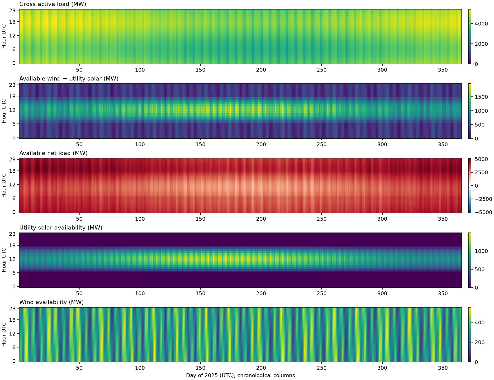
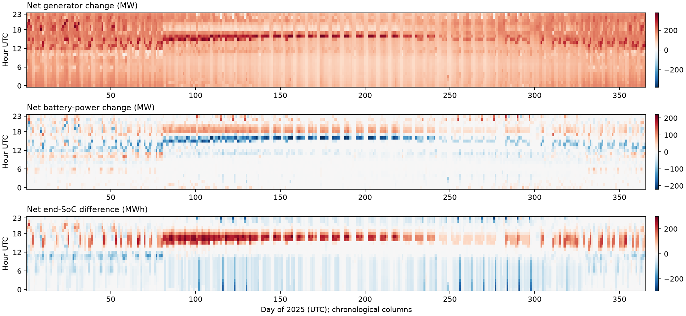
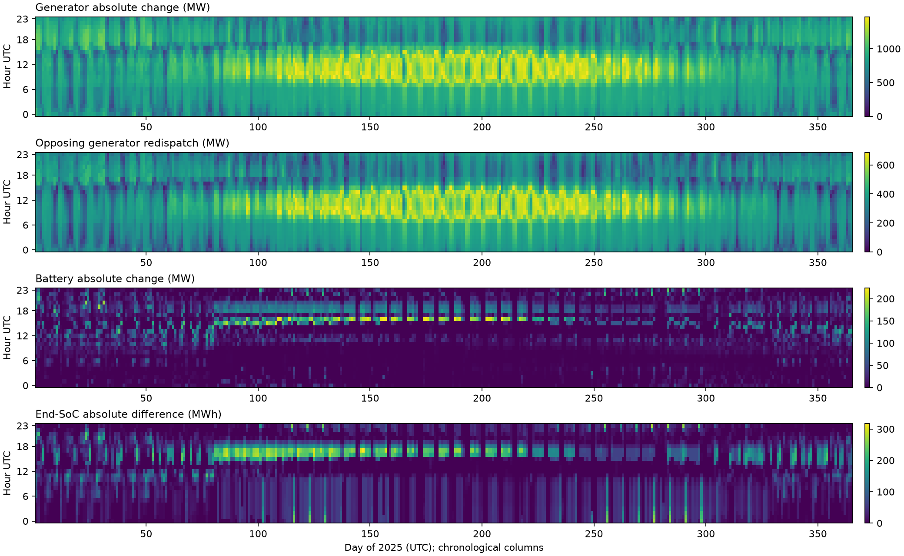
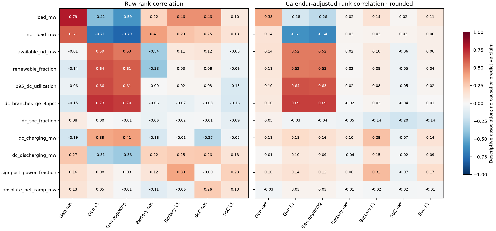

# S5 annual Case118 hierarchy report

Scientific report approved by the owner on 2026-09-17. Numerical execution and
the authorized full reconstruction are complete; the complete accepted payload
is saved in [S5_RESULTS.json](S5_RESULTS.json). Independent result review is
CLEAN. The scientific closeout was committed in `9c26366`, followed by artifact
promotion in `0ae9d86`; S5 is formally closed. The owner chose to omit S6's
optional congestion sensitivity on the toy data. The figures and descriptive analysis
below use the frozen inputs and retained results. The closeout reconstruction
re-audited the archives without new study solves.

**This run did not use the owner's supplied Tracy trajectories.** It is a
separate analytical toy-data benchmark. The intended Tracy annual study remains
uncompleted. This distinction applies to every numerical claim in this report.

## Outcome and scientific object

S5 completed all 8,760 hourly controlling AC intervals across twelve fixed
shards and six ordered waves. The independent analyzer returned
`classification="accepted"`, `execution_complete=true`, and
`accepted_for_s6=true`. The result demonstrates a complete, residual-checked
annual trajectory under the realized, operator-assisted execution procedure.
It does not demonstrate an uninterrupted run under one unchanged recovery
policy: ten reviewed continuations, recovery-policy amendments, and two
once-only operator interventions are part of the result.

The study uses the conditioned, rated PGLib-derived Case118 scenario, a frozen
annual lossy-DC outer plan, three-hour receding AC windows (shortened at shard
ends), and one-hour first-action execution. Ideal storage transfers physical
state between actions. Hard terminal SoC targets come from the outer plan;
fixed loads have no shedding option. Each shard starts from its manifest
boundary state and uses its own causal-controller history. The accepted merge
covers the entire year and checks the joins. This is the qualified partitioned
policy, not an assertion of equality to an uninterrupted annual controller or
a single 8,760-step AC optimization.

## Provenance of load and nondispatchable-generation time series

The hourly inputs are deterministic synthetic profiles generated by
[`scenario.py`](scenario.py), not measured utility demand, historical weather,
or recorded renewable production. Their index spans 2025-01-01 00:00 through
2025-12-31 23:00 UTC at one-hour spacing. The year supplies calendar labels
and weekday/weekend structure; it does not identify an observed 2025 dataset.
The profiles use fixed analytic formulas with no random draws or random seed.

**Loads.** The per-bus baseline active and reactive demand values come from the vendored
`pglib_opf_case118_ieee.m` snapshot at PGLib-OPF commit
`dc6be4b2f85ca0e776952ec22cbd4c22396ea5a3`, distributed under CC BY 4.0.
The [source manifest](source/manifest.json) records the source-file and
normalized-array hashes; the [source note](source/README.md) records acquisition
URLs and licensing. This is the provenance of the network's base demands,
not of an hourly load dataset.

The solver receives explicit hourly active- and reactive-load series, not
constant demands. For all 99 load channels, the scenario generator constructs
these series as `P_i(t) = P_i,base * L(t)` and
`Q_i(t) = Q_i,base * L(t)`, using the PGLib baseline values and one common
hourly multiplier `L(t)`. That multiplier combines an annual cosine
(amplitude 0.10), a daily cosine peaking at 18:00 UTC (amplitude 0.11),
weekday/weekend offsets (+0.035/-0.055), and three fixed oscillations with
periods 173, 619, and 41 hours representing weather-like variation. It is
normalized to annual mean one before rounding. This preserves each bus's
base demand share and reactive-to-active ratio where defined; it does not
model independent regional load shapes or measured weather sensitivity.

**Nondispatchable generation.** Solar availability uses a positive daytime
sine over 06:00–18:00 UTC, multiplied by an annual seasonal envelope and
bounded oscillatory cloud-like modulation. Wind availability uses a constant
0.43 plus oscillations with periods 149, 509, and 31 hours, clipped to capacity
factors between 0.05 and 0.90. These are illustrative wind-like and solar-like
shapes, without geographic or meteorological calibration. In particular,
the solar daylight window is fixed throughout the year.

The selected S0 pilot point fixes total annual *available* renewable energy at
15% of annual load energy, split equally between wind and solar. Each device's
capacity is that energy allocation divided by the sum of its hourly capacity
factors (with one-hour intervals). The resulting capacities are 739.326 MW
for `wind_case118` at bus 105 and 1,498.888 MW for `solar_case118` at bus 65;
each has an apparent-power rating with the same numerical value in MVA.
Sites follow the frozen electrical-distance/load-weighted clustering rule,
not observed plant locations. These series specify available active power;
accepted dispatch may curtail it, so 15% is not a claim about realized renewable
generation. See [the S0 construction and selection record](S0_REPORT.md).

All three normalized profiles are rounded to nine decimal places before
materialization. [`s4_fixture.py`](s4_fixture.py) carries the selected profiles
unchanged into the annual inputs and checks hashes of the complete prepared
active-load, reactive-load, and renewable-availability arrays. The S5 execution
context binds that same scenario. The prepared-array hashes are:

| Input array | SHA-256 |
| --- | --- |
| Active load (MW) | `2f1845f158ed5149b36cb5587d579c09d821d475e02285d2e348f6521bf27764` |
| Reactive load (MVAr) | `e11d9fe44698056270896f6134735d5f1300da774b65b10bbb942ac5f4baf90b` |
| Nondispatchable availability (MW) | `529e2cd33f57c16b9ca5702d2c023e4739d1fedf43d1134456cd1a9ab2c4245b` |

These construction choices make the year reproducible but do not establish
realistic joint load/weather extremes, spatial diversity, or forecast errors.
The scientific conclusions below are conditional on these synthetic inputs.

## Final inputs and the operating regime they impose

The [closeout methods and data index](s5_closeout/README.md) records the exact
formulas, units, input identities, metric definitions, and reproduction commands.
[Final per-device arrays](s5_closeout/final_inputs.npz) retain the historical
input hashes above; [aggregate inputs](s5_closeout/aggregate_inputs.csv),
[annual summaries](s5_closeout/input_summary.json), and
[monthly summaries](s5_closeout/monthly_inputs.csv) describe those same arrays.
Distributed solar is **not modeled**, rather than an observed zero source.

Each panel has 24 hour rows and 365 day columns. These are available inputs,
not generator dispatch or curtailment. Net load uses a zero-centered diverging
scale; none of these panels conceals the actual engineering-unit magnitude.
The calendar is 2025 UTC. A later Tracy comparison will render joint color
limits from these saved arrays without changing this historical baseline.

| Input measure | Toy annual value |
| --- | ---: |
| Gross load energy | 37,159,920.000 MWh |
| Available wind / utility solar energy, each | 2,786,994.000 MWh |
| Available renewable energy / load | 15.000% |
| Available net energy | 31,585,932.000 MWh |
| Mean / peak gross load | 4,242.000 / 5,419.507 MW |
| Minimum / peak coincident available net load | 1,505.081 / 5,158.928 MW |
| Peak combined available renewables | 1,968.839 MW |
| Largest upward / downward net-load hourly ramp | +419.875 / −518.710 MW/h |
| Dispatchable Pmax | 6,515.000 MW |
| Net-load exceedance hours / events / energy above Pmax | 0 / 0 / 0 MWh |
| Storage power / energy | 270.975 MW / 1,083.901 MWh |
| Storage E/P / energy divided by average gross load | 4.000 h / 0.2555 h |

The base-case load snapshot equals the annual mean by construction (apart from
profile quantization); it is not an independently observed annual demand.
All hours have positive available net load below aggregate dispatchable capacity.
The 25.485 million MWh sum of instantaneous Pmax-minus-net-load headroom is an
aggregate accounting quantity, not deliverable recharge energy. There is no
aggregate adequacy event here from which to infer required storage capacity.

The imposed load envelope peaks in winter and near 18:00 UTC each day; the
solar envelope peaks in summer around midday. Weekday offsets and shared
load multipliers produce visible stripes and eliminate independent regional
load-shape diversity. Renewable concentration at buses 65 and 105 can create
local export needs even at low system net load. The
[118-bus resource table](s5_closeout/bus_resources.csv) gives demand shares,
generation/storage capacities, and load-minus-available-renewable energy by bus;
these are potential injection patterns, not solved branch flows.

Storage is also concentrated: buses 41, 65, 89, and 105 receive respectively
14.437, 205.946, 28.937, and 21.655 MW, each with four hours of energy at its
own power rating. Bus 65 holds about 76% of the fleet's energy. All start and
annually end at 50% SoC; shard boundary states are the retained DC signposts.
The device circle uses the same numerical MVA rating as the DC MW bound, so
reactive support can reduce available AC real power. Ideal dynamics omit losses.
Generator costs retain inherited constant/linear terms with fleet-wide
quadratic coefficient 1e-4; storage throughput costs 1 objective unit/MWh.
These are experimental economic assumptions, not physical source measurements.

## DC-to-AC changes: net balancing and spatial redistribution

Compare the **executed AC first action** with the frozen annual DC schedule at
the same hour. With device differences Δ = AC − DC, signed net change is
ΣΔ, total absolute change is Σ|Δ|, and opposing generator redispatch is
(Σ|ΔPg| − |ΣΔPg|)/2. The last quantity counts paired up/down movements once.
It removes net balancing algebraically, but does not isolate congestion or
measure the minimum repair required for AC feasibility.

The outer `lossy_dc` formulation is a **network-flow QP**: it enforces nodal
real-power balance and branch MW bounds and penalizes a resistance-weighted
quadratic flow proxy. It has no voltage-angle variables or angle-based
power-flow/loop equations (see [`dc_problem.py`](../../src/cvxopf/dc_problem.py)).
Thus it is more permissive about flow routing than the familiar phase-angle
DC power-flow approximation. AC additionally constrains those flows through
nonlinear voltage physics, actual losses, reactive balance, and MVA limits.
This structural difference is a plausible contributor to the large spatial
redispatch; the present comparison does not isolate its contribution from
the other horizon, storage-state, and local-solution differences.

The [hourly comparison](s5_closeout/hourly_comparison.csv) covers all 8,760 hours,
with archive/controller identities and per-device battery/SoC differences.
The fixed source snapshot was captured on 2026-09-17 at 15:26 UTC. It supersedes
the **partial** 7,289-hour September 16 correlation report for annual claims.
The [summary table](s5_closeout/dispatch_summary.csv) gives the following values.

| Difference | Mean | Median | 95th percentile | Maximum |
| --- | ---: | ---: | ---: | ---: |
| Net generator power, MW | +138.339 | +126.805 | +215.014 | +378.880 |
| Generator absolute power change, MW | 878.237 | 870.719 | 1,325.613 | 1,471.803 |
| Opposing generator redispatch, MW | 369.949 | 366.093 | 607.050 | 686.693 |
| Net battery power, MW | approximately 0 | approximately 0 | +56.237 | +166.320 |
| Battery absolute power change, MW | 16.416 | 1.495 | 85.858 | 224.159 |
| Net end-SoC difference, MWh | +0.141 | −0.037 | +140.156 | +298.797 |
| End-SoC absolute difference, MWh | 35.354 | 16.576 | 154.624 | 317.322 |

Signed percentiles are percentiles of signed values, not magnitudes. The most
negative net battery change is −220.074 MW; the most negative net SoC difference
is −273.381 MWh. The mean hourly generator absolute change is 21.24% of that
hour's load, versus 3.22% for signed net generation change. The absolute battery
change averages 6.06% of fleet power; its p95 is 31.68%. Small signed annual
means therefore conceal substantial device and temporal movements.

Positive battery change means more discharge **or less charging**. End-SoC
compares boundary t+1, plotted at interval-start hour t. Its recurrence is
Δs[t+1] = Δs[t] − Δb[t] × 1 h: current state differences include inherited
history. The annual sum of net battery changes is effectively zero because
both trajectories share boundary conditions. Summing hourly SoC differences
is not a storage throughput or energy-benefit measure.

The [operation summary](s5_closeout/operation_summary.json) reconciles annual
net generator increase, 1,211,848.695 MWh, with 1,211,619.860 MWh AC physical
losses plus the increase in curtailment (228.835 MWh), minus net battery
change. The balance residual is below 1e-6 MWh. DC's loss proxy is an objective
term: its nodal conservation does not consume this physical loss energy.
The 7,693,354.091 MWh integral of generator absolute differences is much larger
than the signed increase; the opposing-redispatch integral is 3,240,748.935 MWh.
These describe changed schedules, not an extra delivered energy requirement.

DC storage throughput was 120,423.879 MWh; realized AC throughput was
234,194.779 MWh. Both aggregate SoC trajectories approach empty and full.
Available renewable energy was 5,573,988.000 MWh; DC used essentially all of it
(0.000697 MWh numerical curtailment), while AC used 5,573,759.164 MWh.
Using the same generation-cost coefficients, DC generation cost is
675,764,920.565 and AC generation cost is 739,922,321.016, a 9.49% increase.
This compares the generation-cost term, not full objectives: DC also prices a
loss proxy and each trajectory has its own storage throughput cost. Neither
the cost increase nor the redispatch establishes an annual value of AC control.

## Grid loading and apparent correlations

The [DC branch table](s5_closeout/dc_branch_loading.csv) retains original
zero-based branch rows, endpoint IDs, unchanged ratings, and loading counts.
For example, branches 94–100, 99–100, and 98–100 reach at least 95% of rating
for 8,650, 7,734, and 7,508 hours respectively. The maximum DC utilization
over all branches is 99.952–100% every hour. Ranking this tiny maximum-bound
slack would mostly rank numerical detail, so the correlations instead use the
95th-percentile loading and the count of branches at least 95% utilized.
These MW/rating proxies measure loading breadth, not AC terminal-MVA loading
or congestion shadow prices. This package does not reconstruct annual AC
branch-by-branch congestion, so it cannot attribute the redispatch to a
particular binding AC constraint.

Both raw Spearman correlations and calendar-adjusted rank correlations are
saved. The latter demean global average ranks within month × hour ×
weekday/weekend groups; they are not ordinary partial correlations controlling
for all network covariates. The displayed adjusted values round MW/MWh to
0.001 and normalized quantities to 0.0001 before ranking, to check sensitivity
to solver-sized distinctions. Unrounded results are also retained.

| DC/input indicator | Adjusted rank association with opposing generator redispatch |
| --- | ---: |
| Count of branches at least 95% utilized | +0.693 |
| 95th-percentile branch utilization | +0.626 |
| Available renewable fraction of load | +0.528 |
| Available net load | −0.643 |

Battery absolute changes have a weaker +0.320 association with the largest
device-wise DC signpost power requirement divided by rating. That covariate
uses the **DC initial state**, not remaining headroom from the inherited AC
state. Excluding the two operator-intervention hours changes the displayed
adjusted coefficient matrix by at most 0.00069; it does not remove the effects
of policy eras, state propagation, or other common causes.

The heatmaps suggest two distinct patterns. In exploratory June–August
10:00–15:00 UTC bins, mean opposing generator redispatch is 560.47 MW, versus
296.16 MW in December–February at the same hours. This is consistent with a
renewable-location/network interaction at lower net load, not a summer gross
load maximum. During March–June, net battery change averages −45.51 MW at
13:00–16:00 and +36.13 MW at 17:00–21:00, consistent with shifting energy toward
later discharge. These bins were chosen after viewing the patterns; they are
descriptive examples, not predeclared inferential comparisons.

Recovery selections tell a different story. April has 56 and May 45, versus
four in July and five in August. Across the year, recovery-selected hours have
mean opposing redispatch 337.96 MW versus 370.92 MW in primary-selected hours;
mean battery absolute changes are 16.53 versus 16.41 MW. Large AC schedule
changes therefore do not simply coincide with recovery selections. The
[month-by-recovery table](s5_closeout/monthly_recovery_groups.csv) preserves
denominators and covariates. Calendar structure, sequential policy changes,
shard boundaries, and local solver paths prevent a causal difficulty claim.

All associations are exploratory, univariate, and temporally dependent.
Load, renewable share, and loading breadth are interrelated. Power balance
links generator/battery changes; the state recurrence links battery/SoC
changes. These are not independent corroborating mechanisms. No IID p-values,
prospective predictive skill, or rule for skipping AC is inferred here.

## Retained numerical results

The following values come from `results/s4b_annual_ac/merged-result.json` and
agree with the retained summary of the completed independent analysis.
Costs are in the model's objective units; energy quantities are in MWh.

| Measure | Result |
| --- | ---: |
| Accepted controlling intervals | 8,760 / 8,760 |
| Recovery-selected windows | 258 (2.945%) |
| Recorded timed-out attempts | 236 |
| Shifted-primary selections | 8,491 / 8,748 (97.062%) |
| Annual terminal SoC deviation | 1.2754e-12 MWh |
| Sum of absolute window-terminal signpost deviations | 2.9932e-5 MWh |
| Maximum voltage violation | 0 pu |
| Maximum thermal violation | 4.5128e-6 MVA |
| Realized generation cost | 739,922,321.016 |
| Storage cycling cost | 234,194.779 |
| Absolute storage throughput | 234,194.779 MWh |
| Active network losses | 1,211,619.860 MWh |
| Renewable curtailment | 228.836 MWh |

These are accepted numerical residuals and realized first-action aggregates.
The signpost statistic sums deviations at the ends of planned AC windows; it
is not a measurement of hourly realized SoC tracking error. The annual terminal
statistic describes the final boundary, not the largest error at every shard
boundary. The tiny voltage/thermal residuals establish compliance with the
declared acceptance tolerances, not stability margins or a global optimum.

There are 8,748 shifted opportunities because the twelve shard starts have no
preceding in-shard controller. A recovery-selected window is one whose chosen
controller was not its original primary. Under speculative execution, a helper
can win while the primary is still running, so this is not a primary failure
rate. Similarly, the timeout count includes retained timed-out attempts and
speculative solve-budget terminations; it is not a count of distinct failed
hours and is not necessarily a subset of the recovery-window count.

## Where recovery was selected

Intervals below use zero-based, half-open global-hour coordinates. Counts are
read from the twelve retained `shard-result.json` files.

| Shard | Interval | Hours | Recovery windows | Timed-out attempts |
| --- | --- | ---: | ---: | ---: |
| 000 | [0, 682) | 682 | 27 | 27 |
| 001 | [682, 1452) | 770 | 24 | 24 |
| 002 | [1452, 2213) | 761 | 38 | 37 |
| 003 | [2213, 2965) | 752 | 55 | 55 |
| 004 | [2965, 3723) | 758 | 42 | 40 |
| 005 | [3723, 4468) | 745 | 29 | 28 |
| 006 | [4468, 5211) | 743 | 4 | 0 |
| 007 | [5211, 5956) | 745 | 7 | 0 |
| 008 | [5956, 6726) | 770 | 14 | 16 |
| 009 | [6726, 7475) | 749 | 8 | 1 |
| 010 | [7475, 8187) | 712 | 5 | 3 |
| 011 | [8187, 8760) | 573 | 5 | 5 |
| Total | [0, 8760) | 8,760 | 258 | 236 |

The first 4,468 hours contain 215 of the 258 recovery selections (83.3%).
This identifies a useful region for subsequent investigation. It does not
establish a seasonal cause or demonstrate that the later scheduler is faster:
operating conditions, shard boundaries, and recovery-policy exposure differ.
Matched counterfactual runs would be needed to separate those effects.

Early execution used the five-minute primary budget followed by sequential
causal recovery. Later reviewed execution used `causal_first_speculative_v1`:
the primary could continue beyond five minutes while a shared helper explored
alternative starts. Subsequent revisions added persistence after bounded
failures. At most two shards and three solver processes could run concurrently.
The model, hard targets, and physical acceptance gates remained the same;
initialization order, budgets, and winner selection are part of the amended
execution policy. See [the recovery plan](S5_SPECULATIVE_RECOVERY_PLAN.md) and
the applied source-transition records for the historical versions.

## Resources and clocks

The completed analysis reported the following resource summary. Reading the
sixteen retained supervision records reproduces these four aggregates without
repeating the scientific archive audit.

| Measure | Result |
| --- | ---: |
| Maximum sampled worker current RSS | 12,441.53 MiB |
| Maximum sampled simultaneous aggregate current RSS | 23,430.91 MiB |
| Maximum sampled supervisor current RSS, reported separately | 2,483.13 MiB |
| Sum of supervisor invocation critical-path durations | 502,850.83 s (139.68 h) |
| Sum of archived window-path durations | 846,550.71 s (235.15 h) |
| Sum of selected-controller solver durations | 614,385.24 s (170.66 h) |

The sampled worker and aggregate peaks remained below their 16 GiB and 24 GiB
hard limits. This is a statement about retained current-RSS samples, not a
bound on unobserved peaks, compressed memory, or total machine memory use.
Wave 2's accepted speculative invocation retained eight `memory_pressure`
events at intervals 3361, 3362, and 4228. The speculative policy has a separate
22 GiB pressure threshold that cancels helper work before the aggregate hard
ceiling; these events must not be erased by saying simply that no resource
event occurred.

The clocks answer different questions. Supervisor time sums the retained
active invocations and excludes stopped gaps between them. Window-path time
sums per-window durations across concurrently running shards. Selected-solver
time excludes unsuccessful and canceled competitors and is not total compute
effort. None of these quantities is interchangeable with calendar elapsed
time or CPU-hours, and they must not be added together. In particular,
speculative attempts overlap and may consume effort without supplying an
action. The accepted merge is not a complete standalone ledger of all such
effort; detailed speculative records retain it separately.

The merge also retains operator diagnostic compute (1,064.38 s), diagnostic
elapsed time (1,065.12 s), diagnostic overlap with live recovery (848.40 s),
and the interrupted recovery's observed open duration (2,944.50 s). These are
distinct fields, not additive components of annual runtime.

## Reviewed interruptions and interventions

The six waves required sixteen supervision invocations: six accepted, five
`supervisor_interrupted`, four `supervisor_failure`, and one
`worker_process_failure`. Ten reviewed continuation records preserve the
abnormal history. The root outcome labels are a separate summary and need not
equal the more specific supervision labels.

The retained sequence includes these material events:

- An intentional pause after 505 accepted intervals allowed correction of
  repeated annual-signpost validation. The existing accepted prefix was
  preserved across the reviewed source transition. See
  [the validation continuation record](S5_VALIDATION_CONTINUATION.md).
- At interval 2448, a primary timeout and prolonged unsuccessful recovery
  led to a controlled stop. An exact separately retained causal slot-8
  diagnostic was accepted once through the reviewed intervention. Bypassed
  slots and overlapping diagnostic time remain explicit. See
  [the intervention record](S5_INTERVAL_2448_INTERVENTION.md).
- A subsequent restart was interrupted and received a reviewed retry/log
  correction. Later, shard 003 had completed through boundary 2965 but its
  final report failed because the auditor incorrectly required copied
  target-free recovery for every timeout. Interval 2450 had instead used
  accepted causal perturbation 6 after an unsuccessful target-free attempt.
  The reviewed audit correction preserved and finalized the accepted prefix.
- Wave 2 retained the controlled speculative cutover, a process-inspection
  permission failure (`ps`), and a further interrupted invocation before
  acceptance. Those operational outcomes remain in supervision history.
- At interval 6122, speculative recovery exhausted its available controllers.
  A post-stop retry of the identical target-free start succeeded; its copied
  hard-target solve also passed. The reviewed once-only repair advanced only
  that interval, followed by a separately bound persistence amendment. See
  [the protocol](S5_PROTOCOL.md#once-only-interval-6122-repaired-recovery).
- Wave 5 retained unresolved-window stops at intervals 7635 and 8631 before
  its final accepted invocation. Reviewed policy-revision handling and Git
  drift checks were corrected during this period. The terminal source is
  commit `e0eb8f05d0f7da1265489a6e69a3f0ecf4c6ec91`; historical segments
  retain their own source identities.

An unresolved local solve or interrupted process is not a certificate of
physical infeasibility. The interventions also prevent claiming that the
initial autonomous recovery policy alone completed the year.

## What this year establishes and leaves open

The result supports the practical feasibility of carrying this synthetic
annual, storage-coupled operating trajectory through short accepted AC
realizations with a frozen convex outer plan, qualified partition boundaries,
checkpoint persistence, and reviewed recovery. Storage throughput is substantial
and every hourly action passed the implemented physical acceptance checks.
The result also identifies recovery tails and execution overhead as material
costs even when most original primaries supply the selected action.

This is one deterministic synthetic year, one conditioned network/scenario,
one realized outer trajectory, and one machine/software environment. It supplies
neither a population reliability estimate nor a causal comparison of recovery
policies. The outer representation work already established weak identification
of some intermediate storage/flow coordinates; this AC realization is
conditional on the chosen outer signposts.

It does not establish global AC optimality, the optimality of three-hour
windows, which hours require AC, or the performance of one-step versus
multistep AC control. There is no matched no-storage, DC-only, or alternative
scheduler control in S5 from which to attribute benefits. It also does not
establish real-grid reliability, contingencies, dynamic or voltage stability,
forecast robustness, commitment/ramping behavior, or lossy-storage performance.
PGLib angle-difference limits are not enforced by this model, so these results
are not a claim of exact reproduction of the full PGLib benchmark operating set.

## Evidence and remaining closeout

The local evidence root is `results/s4b_annual_ac/`. The report uses its accepted
merge, twelve shard summaries, sixteen supervision records, root result,
continuations, and the tracked protocol/intervention notes. These files remain
the existing evidence; this report is not a replacement validation certificate.

| Identifier | SHA-256 |
| --- | --- |
| Annual shard manifest identity | `6d37eff9a3922cf17303d30f66cf4d23417f6ef2cc9dfc6cbba2365d5ec8633a` |
| Accepted outer archive | `6e7d88e8eed39de4a0141b0fe3c8a146fd2ae298a3d3ddc2768ae57247e87031` |
| `merged-result.json` file | `933a77d0a71f29e21f6a8414e72b69e8bb7b0f22ad98d00b3c6d8eb7df915faf` |
| Merge object digest (`merged_sha256`) | `11c88aaa54957a1fe787a7932bab72e8e8c492a811806fe288f3ef028f461f5a` |
| `run-result.json` file | `6e567ed28d89f73f4e36ffaf24ffbcf746621b904b8db3fc9d0c159647c04609` |
| Current complete analysis object digest | `2ff4b2158c8eb1e2829f92f9f01869b5c6c35d6b29c2fab306e2fed64c3d56d4` |
| Previously completed analysis object digest | `35d703cdabd6b1a3a6771b36ca86edff7b605d308e60ca40c816cf36c8d47d3a` |

The earlier analyzer invocation printed only selected fields and its digest;
the full result was not saved. Its exact retained summary is included as
[prior_analysis_summary.json](s5_closeout/prior_analysis_summary.json), copied
from `outputs/s5_analysis/completed-analysis-summary.json`. It records the
reported passed analysis but cannot substitute for the missing complete payload
or be expanded into one by assuming omitted fields. The accepted merge is
also retained in the [closeout package](s5_closeout/retained_merge.json).

The promotion correction makes `promote_completed` own one full independent
analysis, check its acceptance, and atomically publish that exact canonical
result. The CLI prints the same returned object. It rejects an existing
destination before analysis and accepts no externally supplied result or
skip-validation flag. The owner-authorized two-worker pass completed in
434.83 seconds (7 min 15 s), with 8.72 GiB maximum sampled aggregate RSS
against the 12 GiB cap, and published `S5_RESULTS.json`. Stderr was empty.
Its complete object matches the printed output and passes canonical-byte and
internal-digest checks. Every retained prior summary field agrees exactly
except the full analysis digest, which changes with analyzer-source provenance.
The historical roughly 25-minute serial timing is not a controlled speedup
benchmark: this pass also removes redundant verification traversals.
The [review checkpoint](S5_CLOSEOUT_CHECKPOINT.md) records execution evidence
and file disposition. Independent result and file-disposition review is CLEAN;
scientific commit 1 is `9c26366`, and separate artifact-triage commit 2 is
`0ae9d86`. Subsequent toy studies are documented in the
[counterfactual experiment](../case118_counterfactual/README.md); they do not
change this annual result. S5 is closed; the owner chose to omit the optional
S6 congestion sensitivity on the toy data.
