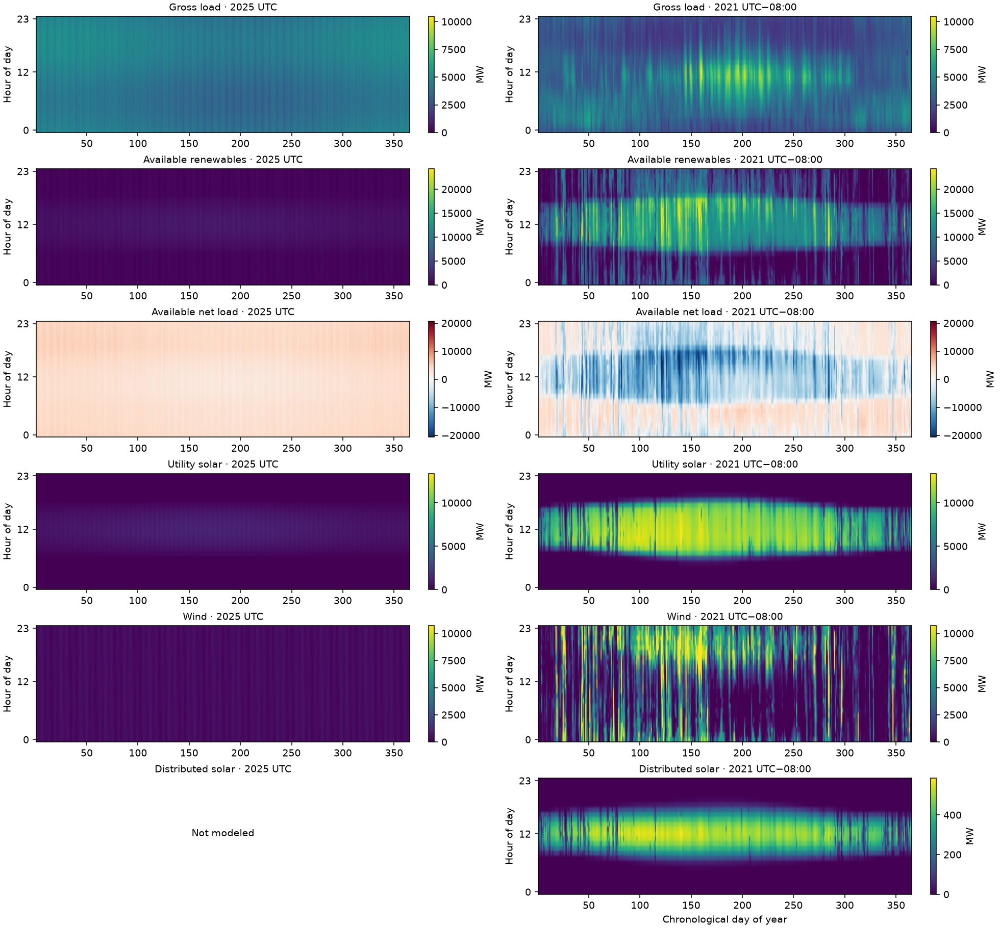
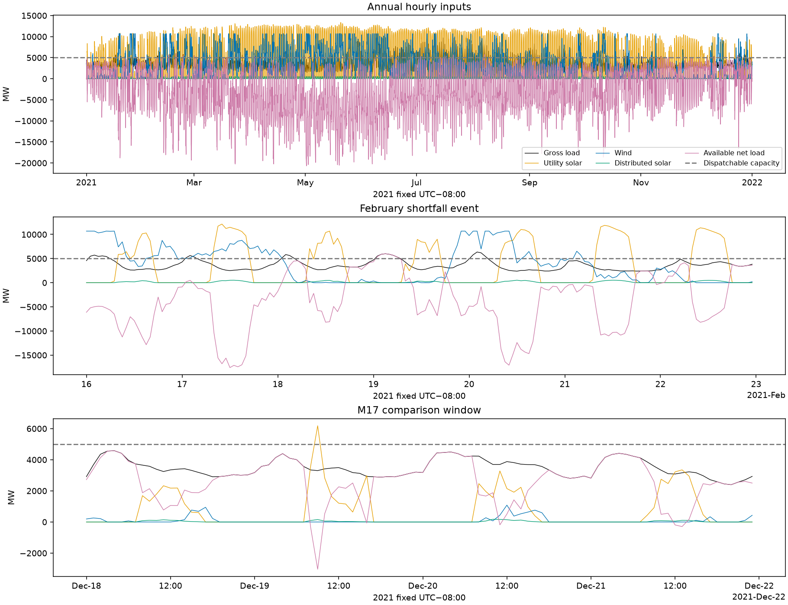
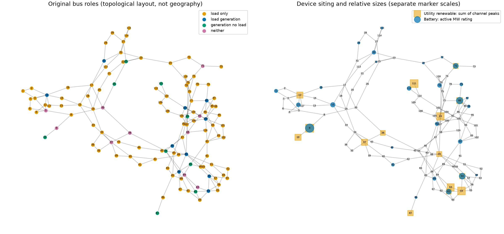

# Stage A — input-review package

Status: prepared for owner review; no numerical solves. This is the owner's
Tracy-derived composite, not a claim of independently verified measurements.
The fixed UTC−08:00 2021 calendar and four distinct source channels are retained.
Source SHA-256 is `45e11f061d736741b18334aea0e9525c355c1a13068c291c1db6ed2e614b1b6f`.

## Review the actual inputs

Left: historical analytical 2025 UTC fixture. Right: scaled Tracy 2021 fixed
UTC−08:00 inputs. Every signal pair uses shared physical color limits; net
load has a common zero-centered scale. Columns align day of year, not weather,
weekdays or simultaneous observations. Old distributed solar was not modeled.

| Quantity | Historical toy | Scaled Tracy |
|---|---:|---:|
| Annual gross load, GWh | 37,159.92 | 30,761.96 |
| Annual available renewables, GWh | 5,573.99 | 58,842.77 |
| Available renewable/load energy ratio | 0.15 | 1.912842 |
| Peak gross load, MW | 5,419.51 | 10,463.20 |
| Peak coincident available net load, MW | 5,158.93 | 6,000.00 |
| Dispatchable capacity, MW | 6,515 | 5,000 |
| Storage energy, MWh | 1,083.90 | 14,046.56 |
| Storage active power limit, MW | 270.98 | 4,682.19 |
| Storage count | 4 | 27 |
| Storage E/P, hours | 4 | 3 |
| Hours net load exceeds dispatchable capacity | 0 | 42 |
| Contiguous shortfall events | 0 | 22 |
| Aggregate positive shortfall energy, MWh | 0 | 13,652.21 |

All four Tracy channels receive the same multiplier, 3.0548333420396085.
Distributed solar is an injection, not subtracted from demand a second time.
Annual renewable surplus does not establish recharge or network feasibility;
the shortfall numbers omit network constraints and storage dynamics.
Many design dimensions differ from the toy study, so this is not an isolated
estimate of a data-source effect.

The February window includes the largest aggregate deficit event. The
December 18–21 panel exposes the window used in the earlier M17 study, using
the new Case118 scaling. No storage trajectory is plotted: none has been solved.

## Siting and devices

The 15 utility sites are:

- Load + generation: 12, 49, 54, 59, 80.
- Generation without load: 10, 61, 69, 87, 111.
- Neither: 9, 37, 38, 63, 71.

The seed produces 10 solar and 10 wind channels on those 15 sites, plus 99
distributed-solar channels proportional to base load. Batteries occupy 27
distinct buses, with equal total capacity allocated to load-side and
renewable-side pools. Exact sites, weights and capacities are in
[buses.csv](stage_a/buses.csv), [renewables.csv](stage_a/renewables.csv), and
[batteries.csv](stage_a/batteries.csv). The map is topological, not geographic;
marker sizes are not estimates of transmission capacity.

The 54 source generator entries are preserved: 19 positive-Pmax units and 35
reactive-support entries. Source Q limits and c0/c1 are unchanged. For positive
Pmax units, c2 = c1/(3 Pmax) at the resized cap; no toy conditioning term is added.
The [generator table](stage_a/generators.csv) includes cost components and
marginal costs at both endpoints. The maximum starting marginal cost is
207.63594 objective units/MWh. Battery regularization is the existing default
0.01 per MWh of absolute one-way throughput (0.02 for a 1 MWh charge/discharge
cycle), rather than the historical toy override of 1.0.

## Operating settings and objective

- Loads retain signed source Q/P ratios; fixed shunts remain network elements.
- Renewable assumed inverter rating is 110% of annual peak availability.
  It is not a measured nameplate. There is no source clipping.
- Ideal batteries use the approved capacity as usable energy, a [0, capacity]
  SOC range, and 50% initial/annual terminal SOC with hard terminal equality.
  MVA rating equals E/3 numerically, so reactive support reduces available
  active output under the AC circle rather than creating additional power.
- All 99 loads permit full fractional shedding at uniform cost
  20,763.594 objective units/MWh. The value is fixed across economic comparisons.
  There is no load-location priority. Fixed-load comparison remains available.
- Available renewable curtailment has no separate penalty. Generation and
  battery costs and load-shedding cost are integrated once over hourly duration.
  The lossy-DC formulation additionally includes its weighted quadratic loss
  proxy. The package default loss weight is 1.0; the numerical study's explicit
  setting remains to be recorded in the Stage B protocol. Single-node has no
  network loss term; AC has physical losses through its balances.
- A hard terminal equality adds no terminal cost. There are no new ramp,
  reserve, unit-commitment or outage constraints.

All three formulations receive the same fleet and applicable parameters;
DC has no reactive optimization. Single-node is comparison-only. Lossy DC
remains the source of AC SOC signposts. Shedding is intended as last resort
but does not guarantee feasibility or successful nonlinear convergence.

## Verification and remaining gate

The [input audit](stage_a/input_audit.json) independently reads the CSV and
reconstructs every hourly allocated load and renewable value from the saved
shares, plus fleet totals and starting costs. It does not repeat the random
site selection: seeded construction and category/pool checks are separate tests.
The [manifest](stage_a/manifest.json) records array/source identities, exact
mapping, software, approved settings and remaining choices. Read
[annual summaries](stage_a/annual_comparison.json),
[monthly summaries](stage_a/monthly_comparison.csv), and
[named source-row checks](stage_a/source_row_checks.csv) for numeric detail.

Focused tests cover source substitution, malformed calendars, negative/nonfinite
inputs, deterministic reconstruction, resource eligibility and allocations,
deliberately corrupted arrays, device settings, and three formulation builds
with shuffled frame columns. Builds verify active/reactive load and renewable
arrays reaching the model, without a solve. No annual model was constructed.
All 19 focused tests pass with the owner-provided CSV present. With its absence
simulated without moving or modifying the data, seven clone-ready tests pass
and 12 source-dependent tests explicitly skip. Production preparation still
rejects missing or substituted source data. See the README for the required
owner-provided path and hash. Ruff and whitespace checks pass. Expected DC
reactive-metadata/storage warnings and the installed CVXPY OpenMP import warning
were observed; no solver was entered. The plots were visually inspected.
This is implementation verification, not yet an independent reviewer sign-off.

**Stop for user review 1.** Review the actual channels, allocations, economic
table and assumptions. Stage B then needs selected week-to-month windows,
boundary policies, sensitivity settings, explicit DC loss weight, budgets and
approval. This package does not authorize Stage B or annual execution.
