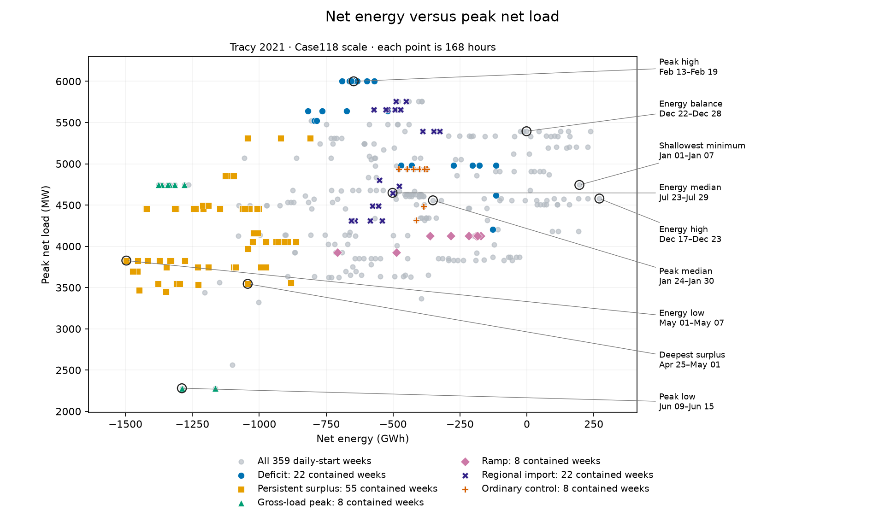
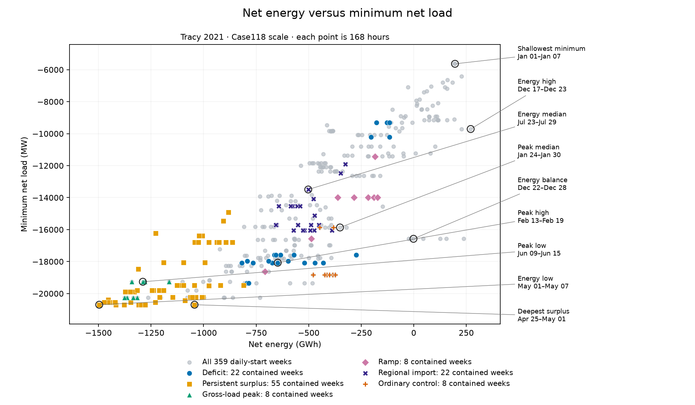
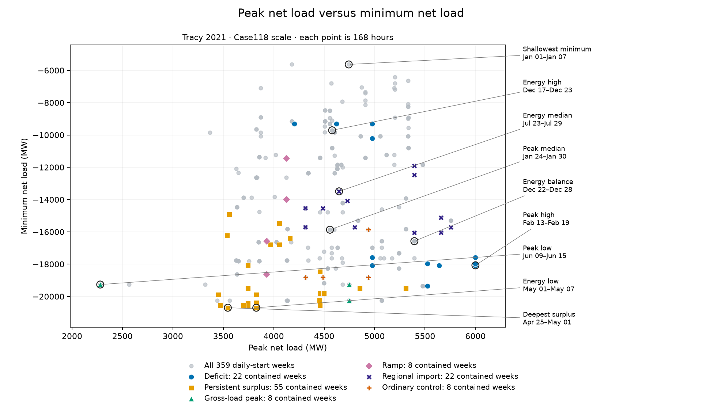

# Stage B — targeted DC studies

Status: **initial run stopped; owner-approved iteration-budget revision pending commit**, opened after owner approval of
Stage A at `39609190f`. The owner authorized beginning Stage B; the numerical
72-solve comparison grid below is owner-approved. Remaining execution details
are proposed for review, not a record of executed work.
The runner and audit are implemented in `run_stage_b.py` and `stage_b.py`.
The initial run at `6d9a492dd` accepted arm 000 and stopped at arm 001, which
returned `optimal_inaccurate` after 200 iterations despite passing every
physical and accounting residual check. A separately authorized replay with
`max_iter=1000` reached native `Solved` / public `optimal` at iteration 348
in 26.4 solver seconds and passed the unchanged audit. The owner approved
raising only the iteration limit on 2026-09-28. Original evidence remains in
`results/stage_b/`; diagnostic evidence is in
`results/diagnostics/arm001_maxiter1000_20260928/`. The diagnostic does not
advance the study. No revised batch has started. Annual DC and all AC
execution remain outside this stage.

## Questions

1. Do the approved capacities and siting support useful storage operation and
   full load service under the rated lossy-DC model?
2. How much does collapsing network restrictions change dispatch, curtailment,
   shedding and per-device SOC?
3. How do generator curvature and battery throughput regularization affect
   storage operation, separately and in combination?
4. Are apparent operating restrictions attributable to finite-window endpoints?

Single-node is comparison-only. It does not replace the lossy-DC source of
future AC signposts. Successful DC windows do not establish annual or AC
feasibility.

## Fixed inputs

Use the approved Stage A source, mapping, device fleet and costs. Verify the
retained source/array identities before construction. Do not resize resources,
redraw sites, change branch ratings, or add temporal noise. Use vectorized time
assembly with SCIPY canonicalization and CLARABEL for both DC formulations.
Retain the package's lossy-DC loss weight of **1.0**, explicitly recorded in
each build. This value is proposed here for the numerical protocol; single-node
has no loss proxy. Keep load shedding enabled at the approved uniform
20,763.594 objective units/MWh with full fractional eligibility, fixed across
all economic comparisons. Renewable curtailment has no separate penalty.

## Input-only window selection

All dates below use the source's fixed UTC−08:00 calendar. Stops are exclusive.
These candidate windows were selected from approved input arrays, not solves:

| Candidate | Interval | Hours | Purpose |
|---|---|---:|---|
| Deficit | February 1–March 1 | 672 | Includes the February 19 peak net load and largest continuous deficit event. |
| Persistent surplus | April 1–June 1 | 1,464 | Two-month coupling; includes the May 1 maximum available surplus. |
| Gross-load peak | June 3–June 17 | 336 | Includes June 9's 10,463.20 MW gross-load peak. |
| Ramp | October 11–October 25 | 336 | Includes the largest absolute hourly net-load ramp, October 17 at 23:00. |
| Regional import | July 12–August 9 | 672 | Owner-approved addition covering the bus-87 region's strongest import week and hourly peak. |
| Ordinary control | January 14–January 28 | 336 | Selected by the deterministic median-profile rule below, not a favorable solve. |

For the ordinary control, consider non-wrapping 14-day windows beginning at
midnight. For each, compute mean load, mean available net load, maximum
positive net load, and mean absolute hourly net-load ramp (differences within
the window only). Standardize each feature by its across-candidate interquartile
range, omitting zero-IQR features. Select the window closest in squared
standardized distance to the componentwise median, excluding overlap with the
four event windows; break ties by earliest start. Save all feature values and
the selected start before any solve.

The ordinary-control selection remains frozen against those original four
event windows; adding the regional-import segment does not reselect the control.

Applying that rule selects **January 14 00:00–January 28 00:00**, exclusive
stop. Of 352 possible fortnights, 194 do not overlap the four event windows.
Medians and IQRs are computed over all 352 candidates before excluding overlaps;
the selected squared standardized distance is **0.129260**. Its mean load is
3,501.04 MW, mean net load −2,562.33 MW, peak positive net load 4,935.28 MW,
and mean absolute hourly net-load ramp 1,391.76 MW. “Ordinary” refers to these
four input features, not proven absence of congestion or solver difficulty.
The [full score table](stage_b_selection/ordinary_candidates.csv) and
[selection record](stage_b_selection/ordinary_selection.json) retain the
features, normalization, eligibility and selected result.

### Weekly coverage of the approved periods

Each point below is one of the **359 seven-day windows starting at midnight**
in 2021, at the approved Case118 multiplier **3.0548333420396085**. Colored
points are those weeks **fully contained** in an approved period: the week's
start is at or after the period's start, and its exclusive stop is at or before
the period's exclusive stop. Partially overlapping weeks are not highlighted.
These are weekly metrics, not totals or extrema over the entire multiweek period.

Deficit contributes **22** weeks; persistent surplus **55**; gross-load peak
**8**; ramp **8**; regional import **22**; ordinary control **8** (weekly starts January 14–21).
Black outlined points retain the notebook's named weeks (including energy and
peak low/median/high); callouts give their inclusive calendar dates. A named
week can also belong to a colored group. Overlapping weeks are descriptive
coverage, not independent samples.







Regenerate these static figures with
`uv run --extra notebook python -m experiments.case118_tracy_2021.plot_window_selection`.
The [weekly table](stage_b_selection/weekly_metrics.csv),
[named weeks](stage_b_selection/labeled_weeks.json), and
[provenance](stage_b_selection/provenance.json) retain the plotted values,
membership and input identity. The live notebook is unchanged.

### Spatial-pressure screen

The input-only rule below is declared before evaluating temporal rankings:

- Form four topological regions using active branches as undirected edges.
  Start at bus 1; repeatedly add the bus farthest in unweighted graph distance
  from its nearest existing seed (smallest bus ID breaks ties). Assign every
  bus to its nearest seed, breaking ties by smallest seed ID. This produces
  connected regions without using load/renewable outcomes or geographic claims.
- Retain every crossing branch in source-row order, including parallel lines,
  and sum its positive finite rateA. Fail rather than invent a rating for an
  unrated cut. This sum is a normalization, not AC transfer capability.
- For each region/hour let L be gross load, R all renewable availability,
  G the approved local generator Pmax sum, and B the local battery MW sum.
  Retain signed L−R, potential import max(L−R,0), import remaining after
  maximum local generation max(L−R−G,0), and after maximum discharge
  max(L−R−G−B,0). Retain potential export max(R−L,0) and export remaining
  after maximum charging max(R−L−B,0). Express each nonnegative score in MW
  and divided by the region's cut-rating sum. No optimized dispatch is assumed.
- For each score compare the full-year hourly maximum and maximum 168-hour
  mean (daily-midnight starts, non-wrapping) with maxima inside the selected windows.
  A week counts only if fully contained. Record earliest ties and coverage of
  positive hours at or above the full-year 99th percentile. Zero-only scores
  have no stress event and no meaningful peak-coverage ratio.

Maximum charging/discharging is an optimistic instantaneous capability, not an
energy-feasible schedule. Export is optional because renewables are curtailable;
imports assume full load service. The screen omits reactive support, voltage,
internal regional bottlenecks and simultaneous constraints on different cuts.
It is neither a dispatch prediction nor an infeasibility certificate. Four
regions are a coarse coverage check, not an exhaustive network-cut search.
Any proposed replacement or additional window returns to the owner for
approval; the approved grid now has six windows and 72 solves.

**Screen completed:** see the [spatial-pressure report](SPATIAL_PRESSURE_REPORT.md),
[region/cut definitions and coverage](stage_b_selection/spatial_screen.json),
and [original five-window score table](stage_b_selection/spatial_coverage.csv).
The original windows missed the bus-87 region's July sustained import pressure
and August hourly peak. The owner approved adding **July 12–August 9**, bringing
the grid to **72 solves**. The [updated six-window coverage](stage_b_selection/spatial_screen_approved.json)
retains the new assessment separately from the original screen. December's
pre-generation pressure remains a documented limitation.

## Comparisons and endpoints

The owner-approved baseline is **rho = 1/3 (on)** and **lambda = 0.01
(medium)**. Run the complete grid:

| Generator curvature | rho | Battery throughput penalty | lambda |
|---|---:|---|---:|
| On | 1/3 | Low | 0.0001 |
| On | 1/3 | Medium — baseline | 0.01 |
| On | 1/3 | High | 1.0 |
| Off | 0.001 | Low | 0.0001 |
| Off | 0.001 | Medium | 0.01 |
| Off | 0.001 | High | 1.0 |

“Off” is the label for the almost-linear setting, not exactly zero curvature.
Lambda has units of objective units/MWh of absolute one-way storage throughput;
rho is dimensionless. Apply rho only to the 19 positive-capacity generators,
using c2_i = rho * c1_i / G_i. Preserve the reactive-only entries' inherited
costs. Inherited c0/c1, all capacities, and the uniform shedding penalty stay
fixed across the grid; do not recalibrate shedding per arm.

Run **all six settings × six selected windows × two formulations = 72 convex
solves**, with matched single-node and rated lossy-DC inputs. This full factorial
comparison supports examining each economic factor and their interaction in
every window and formulation. Run shorter horizons first; freeze the complete
arm order before execution. Each arm starts in a fresh process without a
cross-arm warm start.

All 72 arms use per-device **50% initial SOC and hard 50% terminal SOC**, the
same full-year-derived capacities, and the complete selected window, with no
wrapping or hidden padding. These endpoints are experimental conditions, not
inferred annual states. There are no extra free-terminal sensitivity or
conditional confirmation solves in this batch. If the results indicate a
consequential endpoint effect, propose a separate bounded diagnostic.

After reviewing all available outcomes, recommend annual economics. Do not
select settings by comparing raw objectives across changed cost functions;
compare operating quantities and cost components with their coefficients explicit.

## Execution settings for this implementation checkpoint

- Sequential fresh-process solves; no concurrent arm competition or retries.
- Exactly 72 planned arms in the approved grid; no additional diagnostic or
  confirmation arms without separate approval. Failure stop rules still apply.
- Per-process wall limit: 30 minutes including construction and extraction.
- Per-process peak RSS limit: 16 GiB. The previous eight-hour aggregate proposal
  is superseded by the 72-arm design: at the proposed 30-minute per-arm limit,
  cumulative supervised arm time is bounded by 36 hours, plus orchestration
  overhead. This is a ceiling, not a runtime estimate.
- Stop the batch on a resource termination, exception, solver failure,
  infeasibility, or failed independent audit; retain the failed arm and report
  it. Do not repair data, loosen tolerances or select another solver in flight.
- Check process-monitoring permissions before launch. Record software, native
  solver settings, source identity and host context. Thermal telemetry is
  contextual evidence where available, not an extra scientific acceptance gate.

The following settings are explicit for review, not inferred from solver defaults:

- CLARABEL: `tol_gap_abs=tol_gap_rel=tol_feas=1e-10`, `max_iter=1000`,
  `max_threads=1`. Vectorized assembly, SCIPY canonicalization, `warm_start=False`.
  Other settings remain those of the installed CLARABEL version; its full default
  settings, dependency versions and thread environment are recorded in the binding.
- Accept only public status `optimal`, finite correctly shaped primal results,
  and the independent audit. `optimal_inaccurate`, infeasibility and solver
  exceptions stop the batch. No automatic retry or solver substitution.
- Power balance and injection/reporting residuals: **1e-4 MW**, matching the
  established 1e-6 pu balance scale on this 100 MVA base. Device and branch box
  residuals: **2e-5 MW**; SoC box residual: **2e-5 MWh**, following the prior
  full-bounds diagnostic. SoC recurrence: **1e-4 MWh**; terminal boundary:
  **1e-3 MWh**, following the hierarchical audit. Shedding fractions: **1e-8**.
- ENS reporting: **1e-4 MWh**. Each reconstructed cost and total objective:
  **1e-4 + 1e-10 × abs(reconstructed value)** objective units. Costs include
  generator constants, throughput, shedding, and (only for lossy DC) the
  resistance-weighted per-unit squared-flow proxy with weight 1. No terminal
  cost exists in this hard-equality design. Delta is applied once.
- Arm order: shortest horizon first, then earliest calendar start. Within each
  window: rho on then off; lambda medium, low, high; single-node then lossy DC
  for each setting. All 72 explicit arm records are saved in the binding.
- One-second RSS polling supervises the single worker process (native solver
  threads share that process). The 30-minute clock covers its entire lifetime,
  including imports, preparation, construction, solve, extraction and archiving.
  RSS sampling is not an OS-enforced hard memory cap and can miss brief peaks.
  Missing live-process RSS is a supervision failure. RSS has priority if both
  sampled resource thresholds are exceeded together. Terminate/reap on limits
  or catchable interruption; retain logs, last phase and partial progress.

Atomic JSON/gzip publication, RSS measurement and process-group termination
reuse existing Case118 utilities. The Tracy audit is independent of the built
constraint graph and reconstructs input-aligned bounds, nodal/aggregate balance,
SoC, reporting, ENS and costs. The worker audits before archive publication; the
parent rechecks the retained archive before accepting an arm or advancing.
No process is launched until source reconstruction, the clean-commit check and
RSS preflight pass. No automatic resume: an existing output directory is refused.
Thermal telemetry remains external/contextual, not collected by this runner.

## Review, binding and commands

The study is **stopped**. Review the iteration-budget amendment, then the owner
commits. A subsequent authorized launch must use a fresh output directory and
the new clean execution commit; do not overwrite or resume the original batch.
For example:

```bash
uv run --extra dev python -m experiments.case118_tracy_2021.run_stage_b \
  --commit FULL_REVIEWED_EXECUTION_COMMIT \
  --output experiments/case118_tracy_2021/results/stage_b_maxiter1000
```

The default ignored destination is `results/stage_b/` inside this experiment.
`binding.json` fixes the ordered arms, settings, audit tolerances, commit, software,
source/Stage A/protocol hashes and UTC start. Each fresh worker checks that context
at entry and exit. Do not edit the source tree during execution. `arm-NNN/` contains
the worker log, sampled RSS, latest phase, compressed public results plus availability
and boundary SoC, named costs, solver statistics and immutable completion/supervision
records. Source inputs and explicit device order remain bound to Stage A.

The public SoC array contains post-step states; the saved boundary trajectory
prepends the approved initial SoC. Preparation, construction, combined
canonicalization/solve, extraction/audit and archive durations are separate.
CVXPY compilation time and solver-reported solve time are diagnostic sub-timings,
not additional durations to add to the combined solve clock. Supervisor wall
includes interpreter startup and worker cleanup; parent reconstruction is additional
orchestration overhead. Rejected arms retain available public failure results.

After completion or a stop, independently reconstruct retained accepted arms:

```bash
uv run --extra dev python -m experiments.case118_tracy_2021.run_stage_b --analyze \
  --output experiments/case118_tracy_2021/results/stage_b_maxiter1000
```

This writes `analysis.json` once, retaining both execution and analyzer contexts;
it does not solve or grant annual authority. An incomplete run is reported as
partial. A failed arm stops reconstruction; later arms are not accepted past it.
Do not analyze into the live run directory while workers are writing. Missing
or changed owner inputs fail without fallback. Catchable Ctrl-C/SIGTERM stops
the active worker; an OS crash can leave partial files and requires inspection,
not an automatic restart. The archive is written before the parent advances.
The old batch retains its 200-iteration specification; use its original source
version for its specification-bound analyzer rather than relabeling it.

## Required analysis and next gate

Save per-device dispatch, original/served/shed load, renewable availability/use,
storage power and boundary SOC. Independently check nodal or aggregate balance,
all present-family operating limits, SOC recurrence and endpoints, branch bounds
where applicable, cost decomposition and ENS. Report the DC quadratic loss proxy
as such, not as independently computed AC physical losses.

Compare shedding, curtailment, throughput, SOC, generation leveling/marginal costs,
binding branch locations and durations, and objective components separately.
Record construction, canonicalization/solve, extraction, total wall time and
peak RSS using clearly defined clocks. Distinguish input-predicted stress from
solved congestion. Fixed-load diagnostics, if needed to interpret shedding,
require an explicit additional bounded decision rather than automatic launches.

Stop for the owner's review of Stage B findings and proposed annual economics,
remaining configuration choices, and annual runtime/resource estimates for
both formulations. Stage C requires separate approval.
