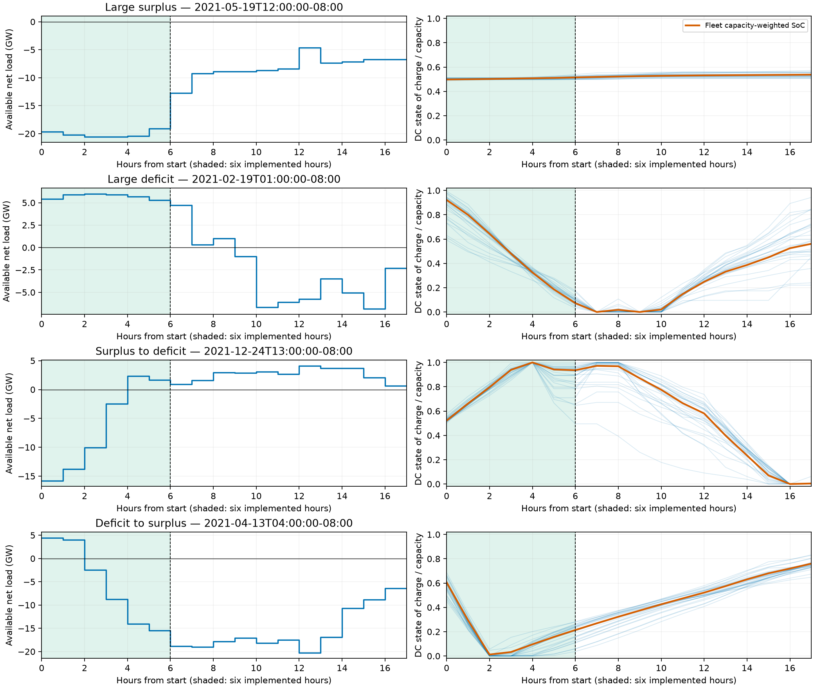

# Stage D — bounded Tracy AC qualification

Status: **opened by owner authorization after shard checkpoint `e09af9dc7`**.
The owner approved the initial design below. Exact start times, solver/start/
recovery settings and the remaining execution details must be reviewed and frozen before
execution. No Tracy AC solve has run. Annual AC execution remains separately gated.

## Fixed scientific configuration

Keep the approved Stage A fleet, input series, Stage C economics (rho = 1/3,
lambda = 0.01), shedding policy and ratings. Use the accepted annual lossy-DC
archive, not a new outer solve or copper-plate targets. Archive SHA-256:
`f984b690497d60dd983314f168be641063a933b0b1b0c717a94f0341d76e9991`.
Verify the [shard manifest](SHARD_BOUNDARIES.json) and device identities.

Retain reactive load signs/Q:P ratios, source generator Q limits, renewable
MVA ratings at 110% of annual peak availability, and battery apparent-power
circles. Enforce voltage and both-terminal branch MVA limits. No extra reactive
regularization, model tuning, or resource resizing.

Use vectorized AC with vectorized sparse P/Q and **automatic sparse dispatch
disabled**, through DNLP/IPOPT. Reuse existing initialization conversion,
complete-x0 capture, acceptance and recovery logic. Do not import historical
numerical starts or rebuild the scheduler.

## D1 — four-period, six-hour rolling horizon comparison

This **replaces**, rather than supplements, the earlier proposed four detached
three-hour probes, 16-request matched-state screen, and two 12-hour rollouts.
No separate numerical warm-up batch is implied.

| Dimension | Approved design |
|---|---|
| Operating periods | Large surplus; large deficit; surplus → deficit; deficit → surplus |
| Implemented duration | Six consecutive hourly actions from each start |
| Look-ahead W | 1, 3, 6, 12 hourly steps; W=3 is the reference |
| Resolution / stride | `delta=1` hour; execute only the first hour of each solve |
| Controlling decisions | 24 per W; **96 overall**, before recovery attempts |
| Review stop | Evaluate these four periods before selecting a larger qualification set |

This gives 16 separate six-hour controller trajectories. Ninety-six controlling
solves are planned if all trajectories complete; failures, diagnostics, recovery
and repeats add attempts and must be separately bounded. Never fill missing
actions in an incomplete rollout from DC or another controller.

### Select and freeze four start times

Propose starts from prepared inputs and accepted DC results before observing
AC outcomes. Available net load is gross load minus all available renewables,
before curtailment or storage. Surplus → deficit is an **increase** in net load;
deficit → surplus is a **decrease**. Use these explicit names instead of
ambiguous “ramp up/down.”

The owner approved selecting surplus/deficit by the minimum/maximum **integrated
six-hour available net energy**, `delta * sum(net_load_mw[t0:t0+6])` in MWh,
not by peak power. For transitions, use the strongest change between the first
and last three-hour means, requiring the appropriate sign crossing. Apply the
padding/shard restrictions below and avoid overlapping implemented periods.
Freeze exact tie-breaking and show the selected dates and input/DC context for
owner review before execution.

The six implemented hours must capture the intended regime or transition,
not merely an extreme somewhere in the look-ahead. Inspect input and DC SoC
context and freeze the exact selection rules, starts, tie-breaking and overlaps
for owner review. Do not automatically reuse earlier three-hour extrema.
These deliberately selected regimes are not an annual random sample.

#### Proposed exact selection — awaiting owner review

`select_stage_d.py` applies the rule in this fixed priority order: surplus,
deficit, surplus → deficit, deficit → surplus. Each subsequent choice excludes
six-hour implemented intervals overlapping an earlier choice; look-ahead overlap
is allowed. Rank surplus by smallest six-hour MWh and deficit by largest.
Rank transitions by largest signed three-hour-mean increase/decrease, requiring
strictly opposite signs in those means. Break every exact score tie by earliest
global start. This is a sign-crossing criterion, not a requirement of monotonic
hourly change. There is no substitute period if a category has no candidate.

| Regime | Start, fixed UTC−08:00 | Global hour | Six-hour net energy (MWh) | Last minus first three-hour mean (MW) |
|---|---|---:|---:|---:|
| Large surplus | May 19, 2021, 12:00 | 3324 | −120,471.916 | +115.138 |
| Large deficit | February 19, 2021, 01:00 | 1177 | +34,202.173 | −155.818 |
| Surplus → deficit | December 24, 2021, 13:00 | 8581 | −38,084.324 | +13,721.378 |
| Deficit → surplus | April 13, 2021, 04:00 | 2452 | −32,261.993 | −14,773.757 |



Shading marks implemented hours; the remaining context supports longer
look-aheads. Faint SoC curves show all 27 devices; orange is capacity-weighted
fleet SoC. Surplus selection is based on **available** renewable energy, not
served renewables: very large surplus may be curtailed rather than stored.
The deficit case substantially depletes DC storage; both transition cases
show material storage movement. These observations describe the accepted DC
reference, not predicted AC acceptance.

Reproduce without an OPF solve:

```bash
uv run --extra dev python -m experiments.case118_tracy_2021.select_stage_d
```

The compact [selection evidence](stage_d_selection/selection.json) retains
source hashes, selection-source hash, exact scores, device IDs and initial SoC.
The owner-provided Stage A source artifacts and accepted Stage C archives are
required locally; no synthetic-data fallback. These candidates are not launch
authority.

Require `[t0,t0+17)` to fit inside the year and one shard to avoid confounding
horizon choice with boundary truncation. The six solves begin at t0 through
t0+5; the final W=12 solve ends at boundary t0+17. All arms implement only
`[t0,t0+6)`; the eleven additional intervals are look-ahead, not executed work.

### State, targets and initialization

At each period's first hour, all W start from the **same 27-device annual
lossy-DC SoC vector at t0**, not the input helper's annual 50% defaults.
Thereafter, each controller advances its **own accepted realized state** and
retains its own preceding accepted AC solution. Do not reset to DC each hour
or share realized states/starts between arms.

At global solve start t, target the exact annual DC per-device SoC at t+W
with a hard equality. The outer trajectory stays frozen. Execute only the
first hour. Do not add a common terminal target at the six-hour reporting stop.

Both look-ahead information and the relevant terminal signpost change with W.
This tests the controller design, not horizon length isolated from terminal
policy. **W=1 ideal-storage hard endpoints fix first-hour battery active power**;
reactive support and other dispatch decisions remain optimized.

The owner approved sequential initialization/recovery, without speculative
racing: use the established cold start for the first action and each
trajectory's own shifted accepted solution thereafter. Recovery uses existing
deterministic alternative-start transformations. The exact finite sequence,
including the position of target-free/copied recovery, remains to be frozen.
Keep solver settings and causal initialization/recovery policy fixed across W.
Freeze exact IPOPT options, first-window start, shifted/padded transformations,
perturbation scales/seeds and any permitted recovery sequence before execution.
There is no preceding AC state for the first decision. Test horizon-dependent
start handling with cheap construction checks and retain complete IPOPT x0,
including auxiliary variables; different-dimensional canonical vectors are
not claimed identical.

Balance rollout order across W and record host/cooling context. Do not cross
this initial experiment with stepwise assembly or alternative helper policies.
No numerical repeats without a declared budget.

#### Proposed numerical configuration — awaiting owner review

Use the existing named-variable cold/shift/copy/perturb transformations rather
than a new initialization implementation. Shift the previous accepted prediction
by one hour, pad battery P/Q with zero and other families with their last value,
project to destination leaf bounds and reconstruct SoC from realized initial
state. Preserve the initial SoC exactly. W=1 must exercise this same transformation
and padding path. Retain complete canonical x0, not just named model variables.

Proposed sequential order, stopping at the first accepted controlling solve:

1. Hard-target cold start (first hour) or shifted own accepted start (later hours).
2. Three hard-target perturbations about that same causal start, scales
   `1e-4`, `1e-3`, `1e-2`, in that order.
3. Target-free diagnostic from the unperturbed causal start.
4. Hard-target copy of the accepted target-free solution, if available.
5. Three hard-target perturbations about that accepted target-free solution,
   using the same ascending scales, if available.

This promotes the already implemented causal perturbations ahead of the
target-free pair, without racing or adopting a new perturbation formula. It is
a proposed study policy, not a claim that this order is optimal. At most nine
solver calls per action (864 for 96 actions, excluding explicitly recorded
interruption retries); unavailable sources skip their dependent attempts.
Target-free acceptance never advances the controller. No terminal softening.
Use existing perturbation semantics: independent normal changes scaled by
`scale * max(1, abs(coordinate))`, destination leaf projection, and unchanged
initial boundary. For global hour `t`, seed `17000000 + 100*t + 10*s + k`, with
source code `s=2` for causal, `s=1` for target-free and scale index `k=1,2,3`.
The same seed rule applies across W, without claiming identical vectors across
different dimensions. Do not perturb or reuse another trajectory's solution.

Use `build.solve()` via the existing verified-x0 path: IPOPT/DNLP,
`warm_start=False` (explicit assigned primal values, not dual-state reuse),
verbose native iteration logs. Preserve the installed CVXPY IPOPT defaults:
`mu_strategy=adaptive`, `tol=1e-7`, `bound_relax_factor=0`,
`hessian_approximation=exact`, `derivative_test=none`,
`least_square_init_duals=no`. These were inspected in the installed
`cvxpy/reductions/solvers/nlp_solvers/ipopt_nlpif.py`; capture versions and
effective options at preflight. Do not set `max_iter`, `max_cpu_time` or
`max_wall_time`; retain IPOPT's built-in iteration limit and document its
effective value before launch. No new acceptable-termination or linear-solver
tuning. Set numerical-library thread limits to one consistently before imports;
retain host/thermal context and do not claim perfectly controlled timing.

Proposed independent acceptance thresholds (maximum over all devices/times):

| Check | Absolute tolerance |
|---|---:|
| AC active/reactive nodal balance, independently reconstructed from voltages and admittances as well as device injections | `1e-6` pu each |
| Voltage bounds | `1e-6` pu |
| Both-terminal branch apparent power | `1e-4` MVA **and** `1e-7` normalized squared excess |
| Storage SoC recurrence | `1e-4` MWh |
| Hard terminal SoC per device | `1e-3` MWh |
| Generator P/Q, ND availability/nonnegativity, storage real-power and SoC boxes | `2e-5` MW/MVAr/MWh in the respective units |
| Storage/ND apparent-power circles | `1e-4` MVA **and** `1e-7` normalized squared excess |
| Load interruption fraction bounds | `1e-8` |
| Served/shed P/Q reconstruction | `1e-4` MW/MVAr |
| ENS reconstruction | `1e-4` MWh |
| Each reported cost and total objective reconstruction | `1e-4 + 1e-10 * abs(reconstructed value)` objective units |

Reuse M17 network/SoC thresholds and Stage B/C box, service and cost thresholds;
the capability-circle checks extend these explicitly to AC. Reconstruct costs
with delta exactly once and the actual AC shedding, not the DC schedule. Require
finite complete arrays, exact device alignment and accepted solver status
`optimal` or `optimal_inaccurate` **plus** all physical checks. Do not accept
`user_limit` solely because some residuals are small. Solver-reported AC
infeasibility is not a global infeasibility certificate. Test these checks
against deliberate single-family violations before numerical execution.

Proposed rollout order (complete six actions per entry before the next):

| Period order | W order |
|---|---|
| Large surplus | 1, 3, 6, 12 |
| Large deficit | 3, 12, 1, 6 |
| Surplus → deficit | 6, 1, 12, 3 |
| Deficit → surplus | 12, 6, 3, 1 |

Each W appears once at each within-period order position. This balances order
positions, not all host/time effects; timings remain single realizations.
Use a fresh worker process per attempt, one at a time, sample worker-PID RSS
every second, terminate/reap on a sample above 16 GiB, and stop the study.
This sampled ceiling is not a guarantee against an unsampled transient peak.
Retain parent timing separately; do not describe PID RSS as process-tree RSS.
No wall-time, elapsed-study or automatic stall cutoff.

### Measurements

- Aligned implemented battery P/Q and SoC, generator P/Q, renewable dispatch/
  curtailment, served/shed load, voltages and branch loading, by fleet and device.
  Include deviations from annual lossy-DC guidance.
- Six-hour executed cost components, energy, throughput, shedding and final
  stored energy. Unequal final SoC can explain apparent cost savings.
- Compare first actions at the common initial state separately from later
  closed-loop actions, whose states and causal starts have diverged.
- Retain full planned windows as diagnostics; do not compare raw objectives
  over unequal look-ahead lengths as equal amounts of executed operation.
- Construction, canonicalization/solve, native solver, extraction/audit,
  archiving, total action latency, iterations and sampled RSS. Include failures
  and recovery in effort totals.
- Completion/recovery counts, rejected attempts, timeouts and cancellations.
  Do not report only successful-solve averages or omit expensive horizons.

### Required checkpoint and restart

The owner requires this initial study to be restartable partway through. Treat
each `(period, W)` as an independent six-hour trajectory with a durable cursor;
also retain the study-level schedule and completed-trajectory registry. Reuse
the existing experiment checkpoint/archive conventions, without adding a new
general scheduling framework.

- Archive the accepted controlling result, physical audit, implemented first
  action, next realized device-aligned SoC, and the accepted solution needed
  for the next shifted initialization **before** advancing the cursor. Use
  atomic writes and reconcile a durable accepted result whose cursor update
  was interrupted, rather than solving or advancing that hour twice.
- On resume, verify the study specification, source/outer/signpost identities,
  period/horizon, numerical settings, execution source and retained accepted
  prefix. Resume from that trajectory's realized state and preceding accepted
  AC solution—not from nominal DC SoC, another W, or a new flat start.
  Skip already accepted actions and completed trajectories. Never overwrite
  retained results or silently reset accumulated work.
- Support an orderly stop that prevents new attempts, terminates/reaps active
  children as needed, and preserves available attempt records. Also handle an
  unexpected interruption by reconciling retained artifacts at restart. Never
  advance from an incomplete or unaudited solve. Ordinary restart is between
  solver attempts, **not** continuation of IPOPT's internal iteration state.
- An interrupted, unaccepted attempt may need to be retried under a new attempt
  identity. Retain its interruption and available timing/resource evidence,
  using the same pending control request and permitted causal sources. Keep
  any accepted diagnostic source required by the frozen recovery sequence;
  resume recovery at a defined position rather than silently changing policy.
- Effort accounting is cumulative across invocations. Resuming does not erase
  attempts or consumed time; distinguish active computation from operator
  downtime. If an abrupt crash leaves timing incomplete, retain that uncertainty
  rather than assigning zero cost. There is no cumulative time cutoff.
- Resume normally requires the same reviewed execution source and numerical
  environment. If code or scientific settings change, stop for an explicitly
  reviewed continuation decision; do not silently combine incompatible runs.
  Provide a concise human-readable stop/status/resume entry point and report
  exactly which trajectory and hour will run next before launching a worker.

Before numerical execution, exercise stop/restart and archive/cursor recovery
with synthetic subprocesses and analytically assigned fixtures. Cover a stop
mid-attempt, a stop after acceptance but before cursor advancement, resumption
mid-trajectory, and skipping a completed trajectory. Verify identical next-state
and shifted-start inputs, exactly-once advancement, and cumulative accounting.
No extra heavy AC solve is required merely to test restart mechanics.

### Budget, execution checkpoint and mandatory pause

The earlier four-probe/two-hour budget proposal is superseded. Neither the
annual DC budget nor an old three-hour AC limit automatically applies.
The owner approved a **16 GiB worker RSS ceiling and no additional time limits**:
no per-attempt, per-action, cumulative worker-time or study elapsed-time cutoff.
Use IPOPT's built-in iteration limit, not a newly imposed study-specific limit;
record the effective value and solver version before execution. Do not add an
IPOPT CPU/wall-time limit or an automatic stall/progress timeout. Provide logs
and progress reporting so the owner can manually stop apparently stalled work.
Runtime is measured, not an automatic stopping criterion.

Run attempts sequentially, with one solver worker at a time. Freeze the finite
recovery sequence and exact monitoring mechanics before launch. If ordinary
numerical failure exhausts permitted recovery, mark that trajectory incomplete
and continue the other independent trajectories. Stop the whole study on an RSS
ceiling violation, inconsistent retained artifacts, or an audit/implementation
defect. A numerical candidate failing a physical acceptance check is a rejected
attempt, not by itself evidence of an audit implementation defect.
Ninety-six controls do not bound all solver attempts. Retain failures without
silent retries, softened targets or changed physics.
An unsuccessful local solve is not proof of physical infeasibility.

Implement and test the bounded runner, request/state lineage, acceptance,
recovery and interruption paths before the reviewed execution commit. Avoid
heavy numerical tests merely to validate software seams.

After these four periods (or an earlier stop under frozen rules), report the
runtime/implemented-operation tradeoff and incomplete cases. **Pause for the
owner to decide which larger set of starts and comparisons to test.** Do not
automatically run the earlier eight-request set, reserved windows or 72-hour
rollout. No operational horizon is changed automatically.

## Later Stage D work — selected after D1 review

The parent plan's broader goals remain, but are not a frozen launch schedule:

1. Extend physical coverage to ordinary operation, gross load/congestion,
   sustained depletion/recharge and actual shard starts as warranted. Choose
   separate validation windows before further tuning. Six hours cannot
   establish performance through a multi-day deficit.
2. Compare time assembly and initialization on identical retained requests:
   vectorized primary, stepwise with the same named physical start, and a
   vectorized alternative from the existing ladder. Freeze the horizon and
   attempt table; count prerequisite source solves. Use a small declared
   repeat set rather than a full Cartesian grid.
3. If supported, exercise at most one challenger to the existing race baseline
   with two primaries and one shared helper. Freeze concurrent budgets and
   test contention, cleanup, acceptance and exactly-once advancement.
4. Qualify longer causal operation and a representative shard join/restart.
   Distinguish continuous realized-state handoff from independent starts at
   nominal DC states. Choose contexts and budget after the initial evidence;
   detached outcomes cannot be stitched into a rollout.

Earlier proposed starts, including December 19 and interior shard boundaries,
are possible future coverage, not approved numerical work. Preserve the owner's
interest in whether DC agreement during stress and differences during surplus
persist under AC realization.

## Evidence, outputs and final gate

Retain every request/attempt, start and x0, solver log/status/residual,
implemented action, phase timing, resource sample and provenance. Independently
audit AC P/Q balance, voltage, generator P/Q, both-terminal branch MVA,
renewable/storage capability, SoC recurrence/endpoints, load service and cost
accounting. Report DC-planned and AC-realized shedding separately. An accepted
target-free diagnostic is not a controlling hard-target action.

Deliver a report and read-only notebook with period/look-ahead selectors,
aligned implemented trajectories and differences, planned-window diagnostics,
timing, memory, residuals and incomplete outcomes.

Stage D exits with independently reviewed physical/runner-policy evidence,
a credible annual runtime/resource range and unresolved risks. Annual AC launch
requires a separate owner decision. No new DC solve, source rescaling, battery
resizing or shard-boundary revision is implied.
