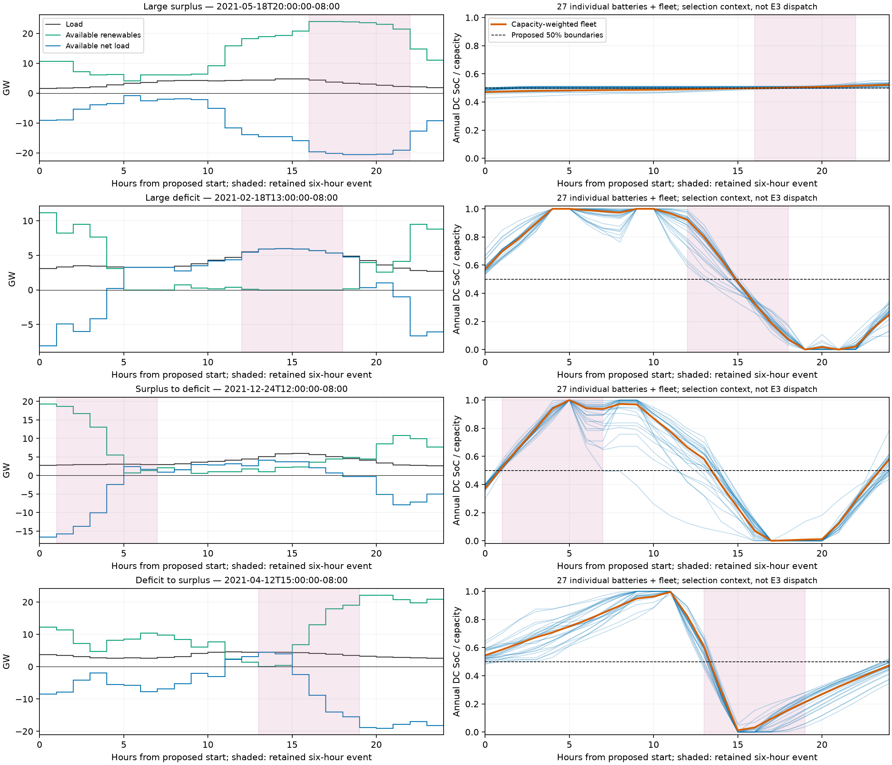
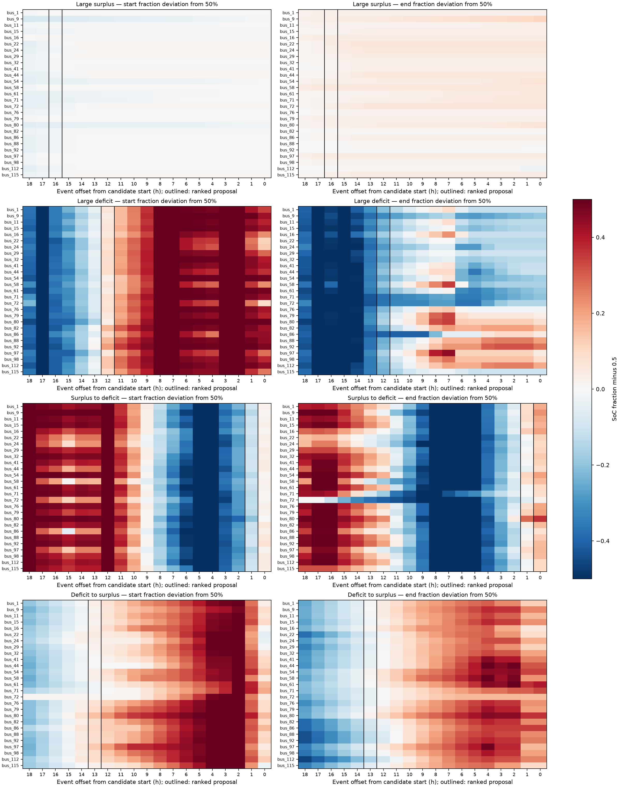

# E3 24-hour window proposals

2026-10-02. No OPF solves; awaiting owner acceptance of dates and boundaries.

Ranked from the accepted annual lossy-DC trajectory using the predeclared equal-device endpoint RMS rule.

| Retained event | Proposed start (fixed UTC−08) | Stop, exclusive | Global hours | Event offset | RMS deviation (percentage points) | Worst deviation (pp) | Fleet start → end |
| --- | --- | --- | --- | ---: | ---: | ---: | --- |
| Large surplus | 2021-05-18T20:00:00-08:00 | 2021-05-19T20:00:00-08:00 | [3308, 3332) | 16 h | 2.38 | 7.14 | 47.0% → 52.2% |
| Large deficit | 2021-02-18T13:00:00-08:00 | 2021-02-19T13:00:00-08:00 | [1165, 1189) | 12 h | 18.97 | 40.45 | 57.2% → 24.8% |
| Surplus to deficit | 2021-12-24T12:00:00-08:00 | 2021-12-25T12:00:00-08:00 | [8580, 8604) | 1 h | 10.20 | 28.71 | 37.2% → 57.8% |
| Deficit to surplus | 2021-04-12T15:00:00-08:00 | 2021-04-13T15:00:00-08:00 | [2439, 2463) | 13 h | 6.10 | 15.26 | 54.5% → 47.4% |





All 76 candidates and every device endpoint are retained in `selection.json` and `candidate_endpoints.csv`. Scores use fractions, not percentage points; displays above multiply by 100. All 27 batteries receive equal weight. Fleet SoC is capacity-weighted and descriptive only.

## Boundary interpretation

The proposed primary experiment remains 50%-to-50% per battery with a hard terminal equality. The displayed annual states are context, not proposed initial/terminal vectors or interior constraints. Selecting the closest candidate does not establish that either endpoint is near 50% or that the energy-neutral policy faithfully reproduces the annual event.

- Large surplus: annual device start range 42.9–50.5%, end range 50.1–55.3%; 24-hour available net energy -258.63 GWh. These describe available net load, not realized shortages or ENS.
- Large deficit: annual device start range 53.4–70.9%, end range 9.6–34.8%; 24-hour available net energy +28.08 GWh. These describe available net load, not realized shortages or ENS.
- Surplus to deficit: annual device start range 29.9–40.3%, end range 43.8–78.7%; 24-hour available net energy -52.18 GWh. These describe available net load, not realized shortages or ENS.
- Deficit to surplus: annual device start range 48.2–64.7%, end range 34.7–52.3%; 24-hour available net energy -176.69 GWh. These describe available net load, not realized shortages or ENS.

No alternative boundary leg is selected or pooled. Please accept or revise the exact dates and the primary 50%-to-50% policy; any net-depletion/accumulation leg needs explicit identity-aligned vectors and four additional arms in its budget.

## Provenance and stopping point

The existing annual reader verifies Stage A inputs, accepted Stage C archives and device identities. Their hashes must match the retained Stage D selection; its original event identities/states are checked without rerunning event selection. `selection.json` retains source hashes, selector/plan hashes, capacities, identities, rule and the proposed primary boundary vectors.

Run from the repository root using a fresh output directory:

```sh
uv run --extra dev --extra notebook python -m experiments.case118_tracy_2021.select_e3 --output experiments/case118_tracy_2021/results/e3_selection_reproduction
```

Required retained annual/input archives are not part of a fresh public clone; missing/substituted evidence fails, with no synthetic fallback. CI selection tests use public synthetic arrays only. This analytical checkpoint does not implement or launch the numerical runner, resume Stage D, establish annual representativeness, or close M11.
