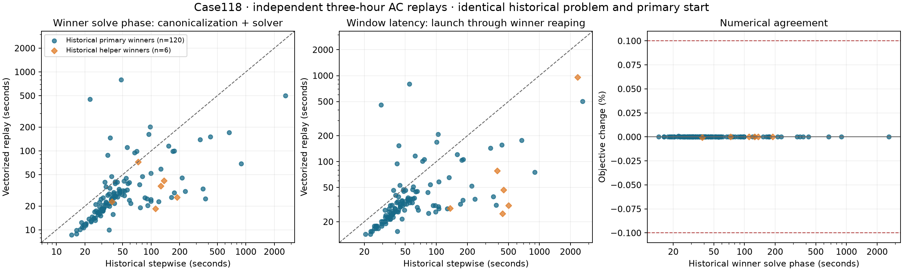

# Independent Case118 three-hour vectorization replay

All 126 sampled windows completed; 126 passed the original independent physical audit. The experiment took 72.08 minutes with the original two-primary/one-helper supervisor (1.75 completed windows/minute). There were 133 attempts, including 7 helper attempts, and 1 helper wins. Attempt outcomes: {'accepted': 126, 'solve_budget': 3, 'lost_race': 4}.
Whole-batch throughput describes this deliberately tail/helper-enriched sample, not predicted annual-study throughput.

The sample contains 120 historical primary winners and six historical helper winners from the completed toy Case118 study. Every replay preserves the historical problem, storage state and target, costs, primary initialization, solver options, and numerical library versions. Only the time assembly changes; there is no new state passed between sampled windows. The original experimental recovery ladder remains enabled.

## Timing

The table estimates the distribution of the 5,154 eligible historical primary-win windows, weighting each sampled window by its stratum population/sample size. Percentiles use the inverse weighted empirical CDF; they are point estimates from this stratified sample, without uncertainty intervals. Solve phase means canonicalization plus solver and retained-start persistence. These historical records do not separate canonicalization from native IPOPT time.

| Weighted statistic | Historical solve phase (s) | Replay winner solve phase (s) | Historical window latency (s) | Replay window latency (s) |
|---|---:|---:|---:|---:|
| Arithmetic mean | 55.21 | 43.47 | 61.71 | 49.35 |
| 50th | 36.38 | 23.87 | 42.70 | 29.72 |
| 90th | 91.54 | 88.67 | 98.31 | 94.73 |
| 95th | 152.87 | 115.14 | 158.84 | 121.06 |
| 99th | 328.88 | 499.01 | 335.68 | 505.05 |

The weighted geometric mean of paired winner-solve speedups is **1.53×**; the corresponding window-latency speedup is **1.44×**. 12 of the 120 sampled historical primary winners had a slower replay winner solve phase. These speedups are paired ratios, not ratios of marginal percentiles.

The slowest sampled historical primary (hour 6455) took 2615.66 s originally and 499.01 s in the replay winner (5.24×). Its new winner order was 0 (zero denotes primary).

The largest window-latency slowdown was hour 6120: 29.09 s historically versus 456.97 s on replay (15.71× longer). Improvements are not uniform across initial-value problems.

Window latency runs from primary process launch to winner reaping, excluding final loser cleanup. Winner solve phase excludes waiting and other contenders, so it must not substitute for window latency when comparing changed race winners. Randomized pairing changes contention for the shared helper; historical machine conditions also differ. This is a matched historical comparison, not a randomized causal estimate of vectorization alone.

Cooling observation recorded at 2026-09-20T20:35:17.330973+00:00: Computer felt hot; owner turned the external fan on a couple minutes before reporting. Approximate; reported as a couple minutes before this note. No precise switch timestamp was measured.
No temperatures were measured at the fan intervention. Later owner-authorized macmon telemetry began at 2026-09-20T20:38:53.957464+00:00; 281 complete samples through solve completion are retained with the artifacts. The reported average CPU temperature ranged from 51.4 to 72.5 °C. This is machine-wide observational data with no pre-fan baseline, and it does not establish a causal fan effect or diagnose throttling.

## Six historical helper winners

| Hour | Old/new winner order | Historical/replay winner solve (s) | Historical/replay window latency (s) | Latency speedup |
|---|---|---:|---:|---:|
| 8297 | 1 / 0 | 38.40 / 22.87 | 136.32 / 28.58 | 4.77× |
| 5879 | 1 / 0 | 72.93 / 72.32 | 388.04 / 78.08 | 4.97× |
| 3270 | 1 / 0 | 110.65 / 18.64 | 440.04 / 24.90 | 17.67× |
| 6794 | 1 / 0 | 136.11 / 41.80 | 448.59 / 47.15 | 9.51× |
| 6164 | 1 / 0 | 188.46 / 25.78 | 501.47 / 31.02 | 16.16× |
| 6458 | 6 / 3 | 125.90 / 36.13 | 2338.05 / 958.50 | 2.44× |

## Races triggered during replay

| Hour | Historical/replay winner solve (s) | Historical/replay window latency (s) | New winner order | Helper outcomes |
|---|---:|---:|---:|---|
| 6120 | 22.51 / 450.59 | 29.09 / 456.97 | 0 | lost_race |
| 6241 | 47.99 / 793.32 | 54.95 / 799.65 | 0 | solve_budget, lost_race |
| 6455 | 2615.66 / 499.01 | 2622.31 / 505.05 | 0 | lost_race |
| 6458 | 125.90 / 36.13 | 2338.05 / 958.50 | 3 | solve_budget, solve_budget, accepted |

`solve_budget` denotes a bounded helper timeout; `lost_race` denotes cancellation after another contender won. Neither supplies a numerical solution.

## Numerical and structural checks

Maximum absolute relative objective change: **0.00079487%**. Windows exceeding the 0.1% inspection threshold: none. Every accepted result is checked by the original build-free network, device, and terminal-SoC audit. Different trajectories are permissible in this nonconvex problem; reactive dispatch remains unregularized.
Close objectives do not imply equal trajectories. Maximum differences across the sampled solutions: Pg 37.211 MW; battery power 57.573 MW; SoC 57.573 MWh; Qg 237.222 MVAr. The CSV distinguishes raw bus-angle differences from differences wrapped modulo 360 degrees; whole-turn offsets are physically equivalent. The maximum wrapped difference is 0.58786 degrees.

Historical primary starts are regenerated and checked exactly before each solve. Auxiliary-value multiset mismatches after canonicalization: none. The vectorized model adds four fixed initial-SoC coordinates, and canonical coordinate ordering changes. Matching auxiliary multisets supplement the exact named-variable check; they are not a coordinate-by-coordinate native-vector identity claim.

Variable-object counts: [51] historical, [17] vectorized. Constraint-object counts: [4057] historical, [1349] vectorized. These count CVXPY objects, not scalar mathematical constraints.

Median replay build phase: 1.264 s, including 0.838 s median historical-initializer reconstruction overhead. Median historical winner build phase: 0.854 s. These are unweighted sample medians. Reconstruction deliberately builds the original initialization graph before mapping; that overhead is not charged to the solve phase.

Maximum sampled RSS: 4.13 GiB per worker tree; 8.90 GiB aggregate including supervisor. These are sampled maxima, not exact process peaks; no matched historical memory-speedup claim is made.

The frozen selection, row-level comparison, and summary are in `artifacts/`. Raw phases, starts, results, lifecycle records, and source hashes are retained under `outputs/case118_vectorization_replay/`. Recompute with `python -m experiments.case118_vectorization_replay.analyze` in the project environment. The sample seed is 20260920; see README.md for population definitions, allocation, and execution commands.
